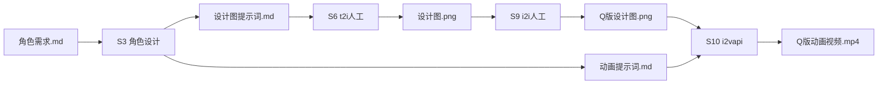

# 角色设计提示词生成

将角色需求转化为专业的AI绘图提示词，输出**设计图提示词**和**动画提示词**两种文件。

## 在流程中的位置



## 核心要求

角色设计图必须满足以下要求：

1. **纯白背景**：背景必须透明，便于后期合成
2. **三视图**：包含正面、背面、侧面三个角度
3. **一致性**：同一角色在三视图中保持外观一致

## 输入

从 `01_需求文档/` 目录读取：

| 文件 | 必需 | 说明 |
|-----|-----|-----|
| 游戏基本信息.memory | 是 | 提供美术风格、世界观背景 |
| 角色需求.md | 是 | 角色外观、性格、阵营、动画需求 |

## 输出

输出到 `02_角色设计/` 目录：

```
02_角色设计/
├── 角色设计总览.md              # 所有角色的总结索引
├── 主角/                        # 第一层：按类型分类
│   └── char_001/                # 第二层：按角色ID命名
│       ├── 设计图提示词.md       # 角色基准形象（三视图）
│       ├── 设计图.png           # [t2i人工产出]
│       ├── 立绘/                # [来自剧本拆解]
│       │   ├── 提示词.md
│       │   └── *.png
│       ├── 动画/
│       │   ├── 提示词.md         # Q版动画提示词
│       │   └── *.png            # [精灵帧提取产出]
│       └── Q版/
│           ├── 设计图.png        # [i2i人工产出]
│           ├── 动画.mp4          # [i2v api产出]
│           └── 精灵图集.png      # [精灵帧提取产出]
├── NPC/
│   └── npc_001/
│       └── ...
└── 怪物/
    └── enemy_001/
        └── ...
```

### 文件夹命名规则

**第一层**：角色类型文件夹
- `主角/`、`NPC/`、`怪物/`

**第二层**：角色ID文件夹
- 格式：`<角色ID>`（如 `char_001`、`npc_001`、`enemy_001`）
- 不包含角色名称

### 角色设计总览.md 结构

详见 [overview-structure.md](references/overview-structure.md)

---

## 本 Skill 产出文件详解

### 1. 设计图提示词.md

**用途**：生成角色基准形象，用于建立角色视觉标准

**下游环节**：S6 t2i (人工)

**详细模板**：[template-设计图提示词.md](references/template-设计图提示词.md)

**核心内容**：
- 三视图（正面、背面、侧面）
- 纯白背景
- 全身像
- 详细外观描述

---

### 2. 动画/提示词.md

**用途**：生成Q版角色动画（用于游戏内角色表现）

**下游环节**：S10 i2v (api)，需要配合 Q版设计图.png

**详细模板**：[template-动画提示词.md](references/template-动画提示词.md)

**核心内容**：
- Q版角色设定
- 各动画状态提示词（待机、行走、攻击、受伤、死亡等）

---

## 非本 Skill 产出（仅创建目录结构）

| 目录/文件 | 来源 | 说明 |
|----------|------|------|
| 立绘/提示词.md | S2 剧本拆解 | 立绘表情提示词 |
| 设计图.png | S6 t2i (人工) | 基于设计图提示词生成 |
| Q版/设计图.png | S9 i2i (人工) | 基于设计图.png转换 |
| Q版/动画.mp4 | S10 i2v (api) | 基于Q版设计图+动画提示词生成 |
| Q版/精灵图集.png | S11 精灵帧提取 | 从动画视频提取 |

---

## 提示词语言要求

**重要**：所有生成的提示词必须使用**中文**。
- 提示词、负面提示词均使用中文描述
- 参考关键词部分可保留英文标签
- 示例：`角色设计图，纯白背景，三视图，正面视图，背面视图，侧面视图，19岁男性主角，年轻战士，轻型外骨骼装甲...`

---

## 工作流程

1. 读取 `01_需求文档/游戏基本信息.memory`，提取世界观背景、美术风格
2. 读取 `01_需求文档/角色需求.md`，提取角色信息、动画需求
3. **为每个角色创建独立文件夹**（按角色ID命名）
4. 在各角色文件夹内创建目录结构：
   ```
   char_001/
   ├── 设计图提示词.md    # 本skill生成
   └── 动画/
       └── 提示词.md      # 本skill生成
   ```
5. 生成提示词文件：
   - `设计图提示词.md`（必需，所有角色）
   - `动画/提示词.md`（所有角色，根据动画需求生成）
6. **更新 `角色设计总览.md`**，为每个角色创建独立区块

---

## 更新逻辑

- 如果角色文件夹已存在，更新其中的提示词文件内容
- 每次运行时重新生成 `角色设计总览.md` 以保持同步
- 仅更新有变更的角色，保留未变更的内容

---

## 调用方式

```
使用 角色设计 skill
输入目录: 01_需求文档/
输出目录: 02_角色设计/
```
