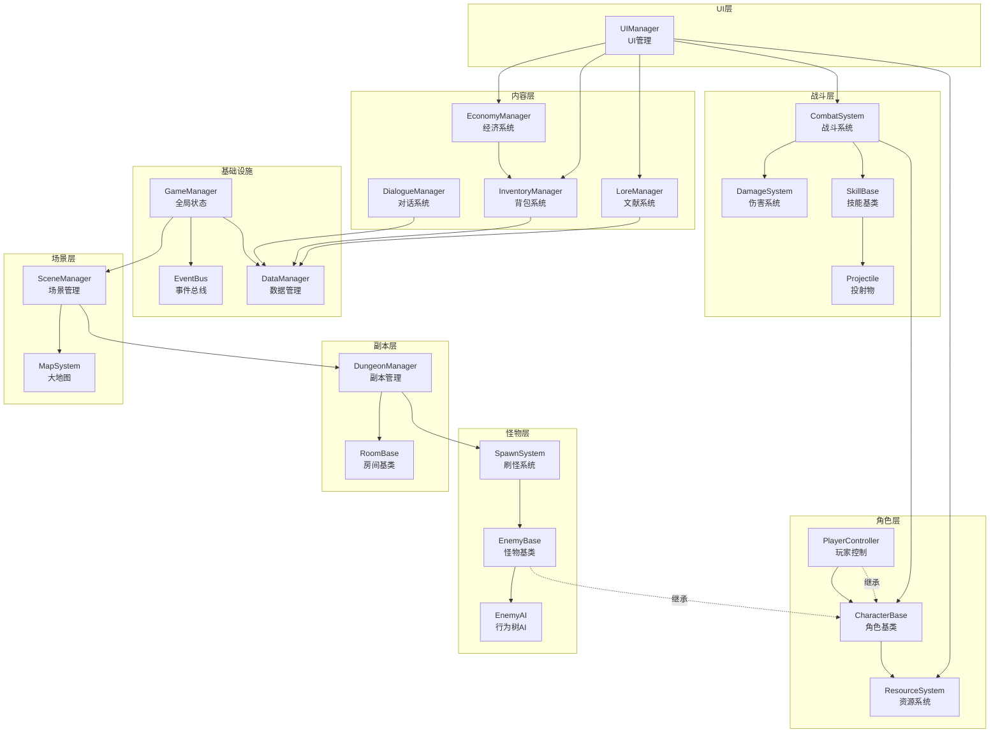

# 需求分析文档

## 系统总览

### 模块依赖图



### 系统分层架构

| 层级 | 系统 | 职责 |
|------|------|------|
| 基础设施 | GameManager, EventBus, DataManager | 全局状态、事件解耦、数据加载 |
| 角色层 | CharacterBase, ResourceSystem, PlayerController | 角色属性、资源管理、玩家输入 |
| 战斗层 | CombatSystem, DamageSystem, SkillBase, Projectile | 战斗逻辑、伤害计算、技能释放 |
| 怪物层 | EnemyBase, EnemyAI, SpawnSystem | 怪物行为、AI决策、刷怪控制 |
| 副本层 | DungeonManager, RoomBase | 房间推进、副本规则 |
| 内容层 | DialogueManager, InventoryManager, EconomyManager, LoreManager | 对话、背包、经济、文献 |
| 场景层 | SceneManager, MapSystem | 场景切换、大地图导航 |
| UI层 | UIManager + 各UI面板 | 界面显示与交互 |

---

## 基础设施

### GameManager (Autoload)

- **优先级**: P0
- **模块文件**: `Scripts/Core/GameManager.cs`
- **职责**: 游戏全局状态管理，协调各系统初始化

**接口定义**:
```
输入:
  - 无（Autoload 自动加载）
输出:
  - CurrentFaction: FactionType      // 当前阵营
  - CurrentCharacter: CharacterBase   // 当前角色
  - GameState: GameStateType          // 菜单/游玩/暂停/过场
信号:
  - GameStateChanged(GameStateType)   → 所有UI
  - FactionChanged(FactionType)       → UI, 剧情, 副本
```

**核心逻辑**:
```csharp
public enum GameStateType { Menu, Playing, Paused, Cutscene }
public enum FactionType { Human, Ascended }

// 单例访问
public static GameManager Instance { get; }
public FactionType CurrentFaction { get; set; }
public GameStateType GameState { get; set; }
```

---

### EventBus (Autoload)

- **优先级**: P0
- **模块文件**: `Scripts/Core/EventBus.cs`
- **职责**: 全局事件总线，实现模块间松耦合通信

**信号定义**:
```
信号名                     触发条件              监听方
----------------------------------------------------------
OnDamageDealt             伤害发生              UI(伤害数字), HUD
OnCharacterDeath          角色死亡              DungeonManager, AI
OnShieldBroken            护盾归零              UI(护盾特效)
OnItemCollected           物品拾取              InventoryManager, UI
OnItemDropped             物品丢弃              InventoryManager, UI
OnSceneTransition         场景切换开始          UI(淡入淡出)
OnDialogueStart           对话开始              PlayerController(冻结输入)
OnDialogueEnd             对话结束              PlayerController(恢复输入)
OnDungeonComplete         副本通关              SceneManager, SaveManager
OnRoomCleared             房间清空              DungeonManager
OnLoreCollected           文献收集              LoreManager, UI
OnCurrencyChanged         货币变化              UI, EconomyManager
OnShieldRegen             护盾开始恢复          UI(护盾条)
```

---

### DataManager (Autoload)

- **优先级**: P0
- **模块文件**: `Scripts/Core/DataManager.cs`
- **职责**: 加载和管理所有游戏配置数据（Resource 文件）

**接口定义**:
```
输入:
  - Resource文件: CharacterData, ItemData, EnemyData, DialogueData, LoreData
输出:
  - GetCharacterData(id): CharacterData
  - GetItemData(id): ItemData
  - GetEnemyData(id): EnemyData
  - GetDialogueData(id): DialogueData
  - GetLoreData(id): LoreData
```

**核心逻辑**:
```csharp
// 启动时加载所有 Resource
public override void _Ready()
{
    LoadAllResources<CharacterData>("res://Data/Characters/");
    LoadAllResources<ItemData>("res://Data/Items/");
    LoadAllResources<EnemyData>("res://Data/Enemies/");
    LoadAllResources<DialogueData>("res://Data/Dialogues/");
    LoadAllResources<LoreData>("res://Data/Lore/");
}
```

---

### SceneManager (Autoload)

- **优先级**: P0
- **模块文件**: `Scripts/Core/SceneManager.cs`
- **职责**: 场景切换、过渡动画、资源预加载

**接口定义**:
```
输入:
  - targetScene: string          // 目标场景路径
  - transitionType: TransitionType  // 淡入淡出类型
输出:
  - CurrentScene: string
信号:
  - OnSceneTransition(string from, string to)
```

**核心逻辑**:
```csharp
public async Task TransitionToScene(string scenePath)
{
    // 1. 触发淡出动画
    // 2. 释放当前场景资源
    // 3. 预加载目标场景
    // 4. 切换场景树
    // 5. 触发淡入动画
}
```

**性能约束**: 场景切换不超过2秒（含过渡动画）

---

## 核心系统设计 (P0)

### 1. 角色控制系统

- **模块文件**: `Scripts/Character/CharacterBase.cs`, `Scripts/Character/PlayerController.cs`
- **依赖**: ResourceSystem, EventBus
- **父节点**: CharacterBody2D

**CharacterBase 接口**:
```
输入:
  - CharacterData: Resource       // 角色配置数据
  - Position: Vector2             // 世界坐标
输出:
  - IsAlive: bool
  - FacingDirection: Vector2      // 朝向（鼠标方向）
  - IsFacingForward: bool         // 正面/背面
信号:
  - OnDirectionChanged(bool forward)
```

**PlayerController 核心逻辑**:
```csharp
// 八方向移动
private void HandleMovement()
{
    Vector2 input = Input.GetVector("move_left", "move_right", "move_up", "move_down");
    Velocity = input * MoveSpeed;
    MoveAndSlide();
}

// 翻滚闪避
private void HandleDodge()
{
    if (Input.IsActionJustPressed("dodge") && _dodgeCooldown.IsReady)
    {
        IsInvincible = true;
        // 播放翻滚动画
        // 启动无敌帧计时器（约0.4秒）
        // 翻滚方向 = 当前移动方向
        StartDodgeRoll();
    }
}

// 朝向判定
private void UpdateFacing()
{
    Vector2 mousePos = GetGlobalMousePosition();
    FacingDirection = (mousePos - GlobalPosition).Normalized();
    // 水平翻转精灵实现左右朝向
    Sprite.FlipH = FacingDirection.x < 0;
    // 根据与鼠标的相对位置判定正面/背面
}
```

**状态机**:
```
Idle → Moving (WASD输入)
Moving → Idle (松开WASD)
Any → Dodging (空格键，无敌帧)
Any → Attacking (左键)
Dodging → Idle (翻滚结束)
Attacking → Idle (攻击结束)
```

---

### 2. 战斗系统

- **模块文件**: `Scripts/Combat/CombatSystem.cs`, `Scripts/Combat/SkillBase.cs`, `Scripts/Combat/TechSkill.cs`, `Scripts/Combat/MagicSkill.cs`
- **依赖**: CharacterBase, DamageSystem, Projectile

**SkillBase 接口**:
```
输入:
  - Caster: CharacterBase
  - Target: CharacterBase (可为null，方向性技能)
  - SkillData: SkillConfig
输出:
  - DamageResult (通过DamageSystem)
  - Projectile实例 (远程技能)
属性:
  - Cooldown: float          // CD时间
  - IsReady: bool            // CD是否就绪
  - ChargeProgress: float    // 蓄力进度 (0~1，仅魔法)
```

**TechSkill（科技体系）**:
```csharp
public override void Execute()
{
    if (!IsReady || !_caster.HasAmmo) return;

    // 消耗子弹
    _caster.ConsumeAmmo(1);

    // 创建投射物
    var bullet = ProjectilePool.Get();
    bullet.Init(_caster.GlobalPosition, _caster.FacingDirection, Damage, _caster);

    // 启动CD
    StartCooldown();
}
```

**MagicSkill（魔法体系）**:
```csharp
public override void Charge(float delta)
{
    if (_caster.Velocity != Vector2.Zero)
    {
        // 移动中断蓄力
        _chargeProgress = 0;
        return;
    }
    _chargeProgress = Mathf.Min(_chargeProgress + delta / ChargeTime, 1.0f);
}

public override void Execute()
{
    if (!IsReady || _chargeProgress < 1.0f) return;

    // 释放蓄力技能
    // 效果强度可基于蓄力程度
    ApplySkillEffect(_chargeProgress);

    _chargeProgress = 0;
    StartCooldown();
}
```

**CD管理**:
```csharp
// 独立管理三种CD
private CooldownTimer _normalAttackCD;   // 普攻CD
private CooldownTimer _skill1CD;         // Q技能CD
private CooldownTimer _skill2CD;         // E技能CD
private CooldownTimer _ultimateCD;       // 终极技能CD

// R键: 科技=换弹, 魔法=加速CD
if (Input.IsActionJustPressed("skill_r"))
{
    if (faction == FactionType.Human) Reload();
    else AccelerateCooldowns();
}
```

---

### 3. 资源系统

- **模块文件**: `Scripts/Character/ResourceSystem.cs`
- **依赖**: EventBus
- **所属**: CharacterBase 组件

**接口定义**:
```
输入:
  - CharacterData (初始属性)
输出:
  - CurrentHP / MaxHP: float
  - CurrentShield / MaxShield: float
  - CurrentAmmo / MaxAmmo: int (仅科技角色)
  - ShieldAbsorbRate: float         // 护盾吸收率
信号:
  - OnHPChanged(float current, float max)
  - OnShieldChanged(float current, float max)
  - OnAmmoChanged(int current, int max)
  - OnDeath()
```

**护盾恢复机制**:
```csharp
private float _shieldRegenDelay = 3.0f;    // 受伤后延迟
private float _shieldRegenTimer;
private float _shieldRegenRate;             // 恢复速率/秒

public void TakeDamage(float amount)
{
    // 受伤后重置恢复延迟
    _shieldRegenTimer = _shieldRegenDelay;
}

public override void _Process(double delta)
{
    if (_shieldRegenTimer > 0)
    {
        _shieldRegenTimer -= (float)delta;
    }
    else if (CurrentShield < MaxShield)
    {
        CurrentShield = Mathf.Min(CurrentShield + _shieldRegenRate * (float)delta, MaxShield);
        EmitSignal(SignalName.OnShieldChanged, CurrentShield, MaxShield);
    }
}
```

---

### 4. 伤害系统

- **模块文件**: `Scripts/Combat/DamageSystem.cs`
- **依赖**: ResourceSystem, EventBus

**伤害类型**:
```csharp
public enum DamageType
{
    Normal,      // 按比例分配护盾/HP
    Poison,      // 无视护盾，直接扣HP，持续DoT
    ShieldBreak  // 巨额扣护盾，不扣HP
}
```

**伤害计算管道**:
```csharp
public DamageResult CalculateDamage(CharacterBase target, DamageInfo info)
{
    var result = new DamageResult();

    // 1. 无敌帧检查
    if (target.IsInvincible)
        return result; // 0伤害

    // 2. 按类型分配
    switch (info.Type)
    {
        case DamageType.Normal:
            float shieldDmg = info.Amount * target.ShieldAbsorbRate;
            float hpDmg = info.Amount * (1 - target.ShieldAbsorbRate);
            ApplyShieldDamage(target, shieldDmg);
            ApplyHPDamage(target, hpDmg);
            break;

        case DamageType.Poison:
            // 无视护盾，直接扣HP
            ApplyHPDamage(target, info.Amount);
            ApplyDoT(target, info.DoTDuration, info.DoTAmount);
            break;

        case DamageType.ShieldBreak:
            ApplyShieldDamage(target, info.Amount);
            break;
    }

    // 3. 触发护盾恢复重置
    target.Resources.ResetShieldRegenTimer();

    // 4. 发送伤害事件
    EventBus.Emit(EventBus.SignalName.OnDamageDealt, result);

    return result;
}
```

**DoT（持续伤害）实现**:
```csharp
private void ApplyDoT(CharacterBase target, float duration, float tickDamage)
{
    // 使用async或协程定时扣血
    // 每秒tick一次，持续duration秒
}
```

---

### 5. 怪物AI系统

- **模块文件**: `Scripts/Enemy/EnemyBase.cs`, `Scripts/Enemy/EnemyAI.cs`, `Scripts/Enemy/Behaviors/`
- **依赖**: CharacterBase, DamageSystem
- **父节点**: CharacterBody2D (地面) / Area2D (空中)

**EnemyAI 状态机**:
```
Patrol → Chase (检测到玩家进入仇恨范围)
Chase → Attack (进入攻击范围)
Chase → Patrol (玩家脱离仇恨范围)
Attack → Chase (玩家离开攻击范围)
Attack → Retreat (特定条件)
Any → Enrage (特殊怪物血量阈值触发)
```

**行为树节点**:
```csharp
// 通用行为
public class PatrolBehavior : BTNode { /* 巡逻路径移动 */ }
public class ChaseBehavior : BTNode { /* 追击玩家 */ }
public class AttackBehavior : BTNode { /* 执行攻击 */ }

// 特殊行为（按怪物类型）
public class GroupAttackBehavior : BTNode { /* 辐射巨鼠：群体攻击 */ }
public class DiveAttackBehavior : BTNode { /* 骨翼鸦：俯冲攻击 */ }
public class RangedAttackBehavior : BTNode { /* 毒液蜘蛛：远程毒液 */ }
public class EnrageBehavior : BTNode { /* 裂变熊：狂暴化 */ }
public class DualHeadBehavior : BTNode { /* 双头狼：协同攻击 */ }
```

**怪物配置数据**:
```csharp
[Resource]
public class EnemyData : Resource
{
    [Export] public string Id;
    [Export] public string Name;
    [Export] public EnemyCategory Category;     // 地面/空中
    [Export] public float MaxHP;
    [Export] public float MaxShield;
    [Export] public float AttackPower;
    [Export] public float AggroRange;           // 仇恨范围
    [Export] public float AttackRange;           // 攻击范围
    [Export] public float MoveSpeed;
    [Export] public AIType AIType;               // AI类型
    [Export] public Godot.Collections.Array<DropEntry> DropTable;
    [Export] public Godot.Collections.Array<string> Abilities;
}
```

**空中单位处理**:
```csharp
// 骨翼鸦使用 Area2D 而非 CharacterBody2D
// 自定义移动逻辑，不受物理碰撞约束
public class FlyingEnemy : EnemyBase
{
    protected override void MoveToward(Vector2 target)
    {
        // 直接插值移动，不做碰撞检测
        Position = Position.MoveToward(target, MoveSpeed * (float)delta);
    }
}
```

---

### 6. 副本/房间系统

- **模块文件**: `Scripts/Dungeon/DungeonManager.cs`, `Scripts/Dungeon/RoomBase.cs`
- **依赖**: SpawnSystem, SceneManager, EventBus

**房间状态机**:
```
Locked → Active (玩家进入)
Active → Cleared (所有怪物死亡)
Cleared → DoorOpen (动画播完)
```

**DungeonManager**:
```csharp
public class DungeonManager : Node
{
    private List<RoomBase> _rooms;
    private int _currentRoomIndex;
    private DungeonType _type;

    public void StartDungeon(DungeonConfig config)
    {
        // 按配置生成房间序列
        _rooms = GenerateRooms(config);
        EnterRoom(0);
    }

    private void EnterRoom(int index)
    {
        _rooms[index].Enter();
        _currentRoomIndex = index;
    }

    // 监听房间清空事件
    private void OnRoomCleared()
    {
        if (_currentRoomIndex < _rooms.Count - 1)
            EnterRoom(_currentRoomIndex + 1);
        else
            OnDungeonComplete();
    }
}
```

**副本类型策略模式**:
```csharp
public abstract class DungeonStrategy
{
    public abstract void ConfigureRooms(DungeonManager manager);
}

public class TutorialStrategy : DungeonStrategy { /* 逐步解锁功能 */ }
public class DefenseStrategy : DungeonStrategy { /* 波次刷怪 */ }
public class StealthStrategy : DungeonStrategy { /* 视角受限 */ }
public class CollectionStrategy : DungeonStrategy { /* 击杀收集 */ }
public class PuzzleStrategy : DungeonStrategy { /* 解谜元素 */ }
public class DialogueStrategy : DungeonStrategy { /* 纯对话推进 */ }
```

**隐藏房触发**:
```csharp
public void CheckHiddenRoom()
{
    // 条件：前N个房间无伤通关
    if (_damageTaken == 0 && _currentRoomIndex >= _requiredRoomsForHidden)
    {
        RevealHiddenRoom();
    }
}
```

**波次管理器**:
```csharp
public class WaveManager : Node
{
    private List<WaveConfig> _waves;
    private int _currentWave;

    public void StartNextWave()
    {
        if (_currentWave >= _waves.Count) { OnAllWavesComplete(); return; }
        var wave = _waves[_currentWave];
        foreach (var spawn in wave.Spawns)
            SpawnSystem.Spawn(spawn.EnemyId, spawn.Position);
        _currentWave++;
    }
}
```

---

### 7. 场景管理/大地图系统

- **模块文件**: `Scripts/Core/SceneManager.cs` (已在基础设施中), `Scripts/Map/MapSystem.cs`
- **依赖**: SceneManager, SaveManager

**MapSystem 接口**:
```
输入:
  - 当前玩家位置
  - 区域解锁状态 (from SaveManager)
输出:
  - 可用目的地列表
  - 区域信息
信号:
  - OnDestinationSelected(string scenePath)
```

**区域解锁**:
```csharp
public class MapSystem : Control
{
    [Export] public Godot.Collections.Array<string> UnlockedRegions;

    public void SelectDestination(string locationId)
    {
        if (!UnlockedRegions.Contains(locationId)) return;
        SceneManager.TransitionToScene(GetScenePath(locationId));
    }
}
```

**场景层级**:
```
MainMenu → WorldMap → Region
                    → Settlement (聚集点)
                              → ShopUI
                              → DialogueUI
                    → Dungeon → Room1 → Room2 → ... → BossRoom
```

---

### 8. 对话系统

- **模块文件**: `Scripts/Dialogue/DialogueManager.cs`, `Scripts/Dialogue/DialogueData.cs`
- **依赖**: DataManager, EventBus
- **数据格式**: JSON

**DialogueData 结构**:
```csharp
public class DialogueStep
{
    public string SpeakerId;        // 说话角色ID
    public string Expression;       // 表情: calm/smile/laugh/angry/rage/sad/think/cold
    public string Text;             // 对话文本
    public string Mode;             // "dialogue" / "monologue"
    public List<DialogueChoice> Choices;  // 分支选项
    public string CutsceneTrigger;  // 过场触发标记
    public string CutsceneImages;   // 过场图片路径（逗号分隔）
}

public class DialogueData
{
    public string Id;
    public string TriggerCondition;
    public List<DialogueStep> Steps;
}
```

**DialogueManager 核心逻辑**:
```csharp
public class DialogueManager : Control
{
    private int _currentStep;
    private DialogueData _currentDialogue;

    public void StartDialogue(string dialogueId)
    {
        _currentDialogue = DataManager.GetDialogueData(dialogueId);
        _currentStep = 0;
        ShowStep(_currentDialogue.Steps[0]);
        EventBus.Emit(EventBus.SignalName.OnDialogueStart);
    }

    private void ShowStep(DialogueStep step)
    {
        // 1. 切换布局模式
        SetLayoutMode(step.Mode);  // dialogue: 分列 / monologue: 居中

        // 2. 加载立绘
        var portrait = LoadPortrait(step.SpeakerId, step.Expression);
        SetPortraitPosition(step.SpeakerId, step.Mode);  // 科技左/魔法右

        // 3. 显示文本（打字机效果）
        ShowText(step.Text);

        // 4. 处理选项
        if (step.Choices?.Count > 0)
            ShowChoices(step.Choices);

        // 5. 触发过场
        if (!string.IsNullOrEmpty(step.CutsceneTrigger))
            PlayCutscene(step.CutsceneImages);
    }

    public void Advance()
    {
        _currentStep++;
        if (_currentStep >= _currentDialogue.Steps.Count)
            EndDialogue();
        else
            ShowStep(_currentDialogue.Steps[_currentStep]);
    }
}
```

**布局规则**:
- 对话模式: 科技派角色 → 左侧(400×800), 魔法派角色 → 右侧(400×800)
- 独白模式: 角色居中
- 文字框: 底部，高度约200px

---

### 9. 背包系统

- **模块文件**: `Scripts/Inventory/InventoryManager.cs`, `Scripts/Inventory/QuickBar.cs`
- **依赖**: DataManager, EventBus

**网格化背包**:
```csharp
public class InventoryManager : Node
{
    private int _gridWidth;          // 背包宽格数
    private int _gridHeight;         // 背包高格数
    private bool[,] _occupiedCells;  // 占用网格
    private Dictionary<Vector2I, ItemInstance> _items; // 位置→物品

    public bool TryAddItem(ItemData itemData)
    {
        // 查找空闲位置（物品尺寸匹配）
        var slot = FindFreeSlot(itemData.Width, itemData.Height);
        if (slot == null) return false;

        PlaceItem(slot.Value, itemData);
        EventBus.Emit(EventBus.SignalName.OnItemCollected, itemData.Id);
        return true;
    }

    public bool TryMoveItem(Vector2I from, Vector2I to)
    {
        // 检查目标位置空间是否足够
        // 执行移动或交换
    }

    public void SetCapacityBonus(int bonus)
    {
        // 机甲角色背包容量更大
        _gridWidth += bonus;
        _gridHeight += bonus;
    }
}
```

**快捷栏**:
```csharp
public class QuickBar : Node
{
    private QuickBarSlot[] _slots = new QuickBarSlot[4]; // 1-4键位

    public void AssignSlot(int index, ItemInstance item)
    {
        // 从背包拖入快捷栏
        _slots[index] = new QuickBarSlot { Item = item };
    }

    public void UseSlot(int index)
    {
        // 按数字键使用消耗品
        _slots[index]?.Item?.Use();
    }
}
```

---

## 扩展系统设计 (P1)

### 10. 经济系统

- **模块文件**: `Scripts/Economy/EconomyManager.cs`
- **依赖**: InventoryManager, EventBus

```csharp
public class EconomyManager : Node
{
    public int Currency { get; private set; } // 纽扣电池（整数单位）

    public bool TryPurchase(int cost, string itemId)
    {
        if (Currency < cost) return false;
        if (!InventoryManager.TryAddItem(DataManager.GetItemData(itemId))) return false;

        Currency -= cost;
        EventBus.Emit(EventBus.SignalName.OnCurrencyChanged, Currency);
        return true;
    }

    public void AddCurrency(int amount)
    {
        Currency += amount;
        EventBus.Emit(EventBus.SignalName.OnCurrencyChanged, Currency);
    }
}
```

**货币获取**:
- 完成任务 → 奖励
- 击杀怪物 → 掉落精粹 → 兑换
- 击杀人形敌人 → 直接获得

---

### 11. 文献收集系统

- **模块文件**: `Scripts/Lore/LoreManager.cs`
- **依赖**: DataManager, SaveManager, EventBus

```csharp
public class LoreManager : Node
{
    private Dictionary<string, bool> _collectedLore = new();

    public void CollectLore(string loreId)
    {
        _collectedLore[loreId] = true;
        EventBus.Emit(EventBus.SignalName.OnLoreCollected, loreId);

        // 检查某时期是否集齐
        var loreData = DataManager.GetLoreData(loreId);
        if (IsPeriodComplete(loreData.Period))
            UnlockBonusStory(loreData.Period);
    }

    public List<LoreData> GetLoreByPeriod(string period)
    {
        return DataManager.GetAllLoreData()
            .Where(l => l.Period == period)
            .ToList();
    }
}
```

---

### 12. 阵营差异系统

- **模块文件**: `Scripts/Core/GameManager.cs` (阵营标识), 各系统内的阵营分支
- **依赖**: GameManager

```csharp
// 阵营通过 GameManager.CurrentFaction 路由不同行为
// 罗兰线(人类): 搜打撤玩法 → 侧重背包/战斗/撤离
// 薇线(升格者): 过剧情玩法 → 侧重对话/探索/文献
```

---

## UI系统设计

### UI架构

```csharp
// UI管理器控制所有面板的显示/隐藏
public class UIManager : CanvasLayer
{
    private Dictionary<string, Control> _panels;

    public void ShowPanel(string panelName)
    {
        foreach (var panel in _panels.Values) panel.Visible = false;
        _panels[panelName].Visible = true;
        GameManager.Instance.GameState = GetGameStateForPanel(panelName);
    }
}
```

### P0 UI 设计

| UI | 类名 | 打开方式 | 关闭方式 |
|----|------|---------|---------|
| HUD | `HUD` | 常驻 | - |
| 主菜单 | `MainMenu` | 游戏启动 | 开始游戏 |
| 暂停菜单 | `PauseMenu` | Esc | Esc/继续 |
| 对话UI | `DialogueUI` | 触发对话 | 对话结束 |
| 背包UI | `InventoryUI` | I/B | Esc |
| 大地图UI | `MapUI` | M | Esc/M |
| Boss血条 | `BossHPBar` | Boss战开始 | Boss死亡 |

### P1 UI 设计

| UI | 类名 | 打开方式 | 关闭方式 |
|----|------|---------|---------|
| 商店UI | `ShopUI` | NPC交互 | Esc |
| 角色面板 | `CharacterPanel` | C | Esc/C |
| 文献UI | `LoreUI` | 菜单 | Esc |
| 设置UI | `SettingsUI` | 菜单→设置 | Esc |
| 伤害数字 | `DamageNumber` | 自动触发 | 自动消失 |
| 副本结算 | `DungeonResultUI` | 副本通关 | 点击 |

---

## 数据结构汇总

### CharacterData (Resource)

```csharp
public partial class CharacterData : Resource
{
    [Export] public string Id;
    [Export] public string Name;
    [Export] public CharacterType Type;       // Player/NpcImportant/NpcMinor
    [Export] public FactionType Faction;
    [Export] public float MaxHP;
    [Export] public float MaxShield;
    [Export] public float ShieldRegenRate;     // 护盾恢复速率/秒
    [Export] public float ShieldRegenDelay;    // 受伤后恢复延迟(秒)
    [Export] public float ShieldAbsorbRate;    // 护盾伤害吸收率 (0~1)
    [Export] public float AttackPower;
    [Export] public int BagCapacity;           // 背包基础容量(格)
    [Export] public int BagCapacityBonus;      // 容量加成(机甲)
    [Export] public int MaxAmmo;               // 最大弹药(0=近战/魔法)
    [Export] public float MoveSpeed;
    [Export] public float DodgeCooldown;
    [Export] public Godot.Collections.Array<string> SkillIds;
    [Export] public Texture2D Portrait;
    [Export] public Texture2D SpriteSheet;
}
```

### ItemData (Resource)

```csharp
public partial class ItemData : Resource
{
    [Export] public string Id;
    [Export] public string Name;
    [Export] public ItemType Type;             // Consumable/Equipment/Material/Lore/Misc
    [Export] public int Width;                 // 背包占用格数(宽)
    [Export] public int Height;                // 背包占用格数(高)
    [Export] public Rarity Rarity;             // 稀有度
    [Export] public string EffectDescription;
    [Export] public int StackLimit;            // 堆叠上限
    [Export] public int BuyPrice;              // 购买价格
    [Export] public int SellPrice;             // 出售价格
    [Export] public Texture2D Icon;
}
```

### EnemyData (Resource)

```csharp
public partial class EnemyData : Resource
{
    [Export] public string Id;
    [Export] public string Name;
    [Export] public EnemyCategory Category;    // Ground/Air
    [Export] public float MaxHP;
    [Export] public float MaxShield;
    [Export] public float AttackPower;
    [Export] public float MoveSpeed;
    [Export] public float AggroRange;
    [Export] public float AttackRange;
    [Export] public AIType AIType;
    [Export] public float EnrageThreshold;     // 狂暴血量阈值(0~1)
    [Export] public Godot.Collections.Array<DropEntry> DropTable;
    [Export] public Godot.Collections.Array<string> SpecialAbilities;
    [Export] public Texture2D SpriteSheet;
}

public class DropEntry
{
    public string ItemId;
    public float Probability;   // 掉落概率 (0~1)
    public int MinCount;
    public int MaxCount;
}
```

### DialogueData (Resource)

```csharp
public partial class DialogueData : Resource
{
    [Export] public string Id;
    [Export] public string TriggerCondition;
    [Export] public Godot.Collections.Array<DialogueStep> Steps;
}

public class DialogueStep
{
    [Export] public string SpeakerId;
    [Export] public string Expression;        // calm/smile/laugh/angry/rage/sad/think/cold
    [Export] public string Text;
    [Export] public string Mode;              // dialogue/monologue
    [Export] public Godot.Collections.Array<DialogueChoice> Choices;
    [Export] public string CutsceneImages;    // 过场图片路径，逗号分隔
}

public class DialogueChoice
{
    [Export] public string Text;
    [Export] public string NextDialogueId;
}
```

### LoreData (Resource)

```csharp
public partial class LoreData : Resource
{
    [Export] public string Id;
    [Export] public string Name;
    [Export] public LoreType Type;            // Fragment/Document/Record/Relic/Cipher
    [Export] public Rarity Rarity;
    [Export] public string Period;            // 时间段
    [Export] public string Content;
    [Export] public string AcquireMethod;     // 获取途径描述
    [Export] public Texture2D Thumbnail;
}

public enum LoreType { Fragment, Document, Record, Relic, Cipher }
```

---

## 开发里程碑

### 阶段1：基础框架 (P0基础设施 + 角色控制)

| 系统 | 产出文件 | 前置 |
|------|---------|------|
| EventBus | `Scripts/Core/EventBus.cs` | 无 |
| DataManager | `Scripts/Core/DataManager.cs` | 无 |
| GameManager | `Scripts/Core/GameManager.cs` | EventBus |
| SceneManager | `Scripts/Core/SceneManager.cs` | GameManager |
| CharacterBase | `Scripts/Character/CharacterBase.cs` | DataManager |
| ResourceSystem | `Scripts/Character/ResourceSystem.cs` | EventBus |
| PlayerController | `Scripts/Character/PlayerController.cs` | CharacterBase |
| 主菜单UI | `Scripts/UI/MainMenu.cs` | GameManager |

### 阶段2：核心战斗 (P0战斗 + 怪物)

| 系统 | 产出文件 | 前置 |
|------|---------|------|
| DamageSystem | `Scripts/Combat/DamageSystem.cs` | ResourceSystem, EventBus |
| SkillBase | `Scripts/Combat/SkillBase.cs` | DamageSystem |
| TechSkill | `Scripts/Combat/TechSkill.cs` | SkillBase |
| MagicSkill | `Scripts/Combat/MagicSkill.cs` | SkillBase |
| Projectile | `Scripts/Combat/Projectile.cs` | SkillBase |
| EnemyBase | `Scripts/Enemy/EnemyBase.cs` | CharacterBase |
| EnemyAI | `Scripts/Enemy/EnemyAI.cs` | EnemyBase |
| SpawnSystem | `Scripts/Enemy/SpawnSystem.cs` | EnemyBase |
| HUD | `Scripts/UI/HUD.cs` | ResourceSystem |
| BossHPBar | `Scripts/UI/BossHPBar.cs` | HUD |

### 阶段3：内容系统 (副本 + 对话 + 背包)

| 系统 | 产出文件 | 前置 |
|------|---------|------|
| DungeonManager | `Scripts/Dungeon/DungeonManager.cs` | SpawnSystem |
| RoomBase | `Scripts/Dungeon/RoomBase.cs` | DungeonManager |
| DialogueManager | `Scripts/Dialogue/DialogueManager.cs` | DataManager |
| DialogueUI | `Scripts/UI/DialogueUI.cs` | DialogueManager |
| InventoryManager | `Scripts/Inventory/InventoryManager.cs` | DataManager |
| QuickBar | `Scripts/Inventory/QuickBar.cs` | InventoryManager |
| InventoryUI | `Scripts/UI/InventoryUI.cs` | InventoryManager |
| PauseMenu | `Scripts/UI/PauseMenu.cs` | GameManager |
| MapSystem | `Scripts/Map/MapSystem.cs` | SceneManager |
| MapUI | `Scripts/UI/MapUI.cs` | MapSystem |

### 阶段4：扩展系统与UI (P1系统 + 剩余UI)

| 系统 | 产出文件 | 前置 |
|------|---------|------|
| EconomyManager | `Scripts/Economy/EconomyManager.cs` | InventoryManager |
| ShopUI | `Scripts/UI/ShopUI.cs` | EconomyManager |
| LoreManager | `Scripts/Lore/LoreManager.cs` | DataManager |
| LoreUI | `Scripts/UI/LoreUI.cs` | LoreManager |
| CharacterPanel | `Scripts/UI/CharacterPanel.cs` | ResourceSystem |
| SettingsUI | `Scripts/UI/SettingsUI.cs` | 无 |
| DamageNumber | `Scripts/UI/DamageNumber.cs` | EventBus |
| DungeonResultUI | `Scripts/UI/DungeonResultUI.cs` | DungeonManager |
| SaveManager | `Scripts/Core/SaveManager.cs` | GameManager |
| AudioManager | `Scripts/Core/AudioManager.cs` | GameManager |

---

## 对象池设计

针对频繁创建销毁的对象，使用通用对象池：

```csharp
public class ObjectPool<T> where T : Node, new()
{
    private readonly Stack<T> _pool = new();
    private readonly Func<T> _factory;
    private readonly Action<T> _resetAction;
    private readonly int _maxSize;

    public T Get()
    {
        var obj = _pool.Count > 0 ? _pool.Pop() : _factory();
        obj.SetProcess(true);
        obj.Visible = true;
        return obj;
    }

    public void Release(T obj)
    {
        _resetAction(obj);
        obj.SetProcess(false);
        obj.Visible = false;
        if (_pool.Count < _maxSize)
            _pool.Push(obj);
        else
            obj.QueueFree();
    }
}

// 使用对象池的对象
// - 子弹/投射物 (Projectile)
// - 伤害数字 (DamageNumber)
// - 掉落物 (DroppedItem)
```

---

## 性能约束汇总

| 指标 | 要求 | 实现策略 |
|------|------|---------|
| 帧率 | ≥60fps | _PhysicsProcess 处理物理，_Process 处理UI |
| 场景切换 | <2秒 | 预加载 + 异步加载 |
| 同屏怪物 | 10-20个 | 对象池 + LOD |
| 内存 | 合理范围 | 摆件按需加载/卸载 |
| UI元素 | 无卡顿 | 对象池复用伤害数字等 |
