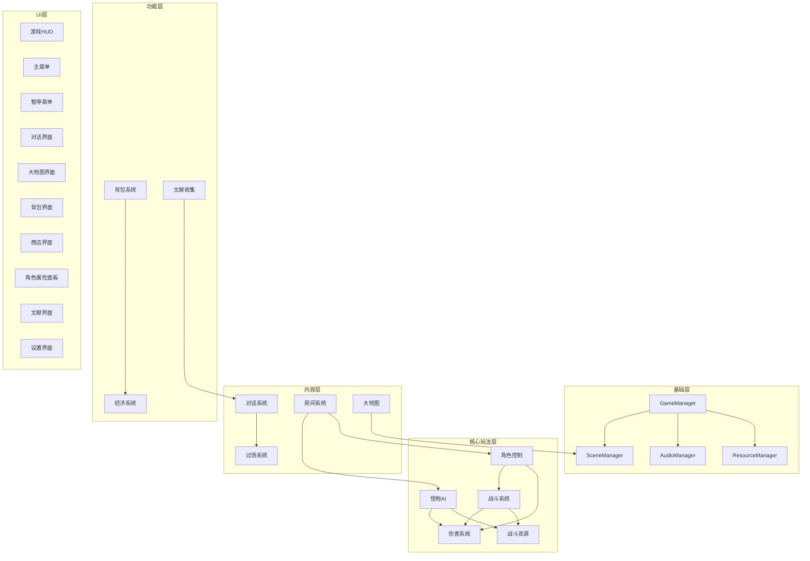

# 需求分析文档

## 系统总览

### 模块依赖图



### 系统分级

| 优先级 | 系统 | 数量 |
|--------|------|------|
| P0 核心系统 | 角色控制、战斗、伤害、怪物AI、房间、对话、大地图、战斗资源、场景管理 | 9 |
| P0 UI | HUD、主菜单、暂停菜单、对话界面、大地图界面 | 5 |
| P1 扩展系统 | 背包、经济、过场、存档、音频管理、资源管理、数据配置 | 7 |
| P1 UI | 背包界面、商店界面、角色属性面板、设置界面 | 4 |
| P2 系统 | 文献收集、文献界面 | 2 |

---

## 系统详细设计

### 1. GameManager（全局管理器）

- **优先级**: P0
- **类型**: Autoload 单例
- **依赖**: 无
- **模块文件**: `scripts/autoload/game_manager.cs`
- **接口定义**:

```
系统名: GameManager
输入:
  - 无（全局入口）
输出:
  - CurrentScene: string
  - PlayerData: PlayerState
  - GameState: enum { MainMenu, Exploring, Combat, Dialog, Cutscene, Paused }
信号:
  - GameStateChanged: 游戏状态变更 → 所有监听UI
  - SceneTransition: 场景切换 → SceneManager
```

- **核心职责**:
  - 维护全局游戏状态（GameState 枚举）
  - 管理玩家数据引用
  - 协调各 Autoload 单例的初始化顺序
- **性能约束**: `_Process` 中不执行逻辑，仅通过信号响应

---

### 2. SceneManager（场景管理器）

- **优先级**: P0
- **类型**: Autoload 单例
- **依赖**: GameManager
- **模块文件**: `scripts/autoload/scene_manager.cs`
- **接口定义**:

```
系统名: SceneManager
输入:
  - targetScene: string
  - transitionType: enum { Fade, Instant }
输出:
  - CurrentSceneName: string
  - IsTransitioning: bool
信号:
  - SceneLoadStarted: 场景开始加载 → HUD（显示加载画面）
  - SceneLoadCompleted: 场景加载完成 → 所有系统（初始化）
```

- **核心职责**:
  - 场景切换与过渡动画
  - 加载画面管理
  - 场景资源预加载
- **性能约束**: 场景切换 < 2秒

---

### 3. AudioManager（音频管理器）

- **优先级**: P1
- **类型**: Autoload 单例
- **依赖**: 无
- **模块文件**: `scripts/autoload/audio_manager.cs`
- **接口定义**:

```
系统名: AudioManager
输入:
  - bgmId: string
  - sfxId: string
  - volume: float (0.0~1.0)
输出:
  - IsPlaying: bool
信号:
  - BgmChanged: BGM切换 → 无
```

- **核心职责**:
  - BGM 淡入淡出切换
  - 音效播放（支持多通道同时播放）
  - 音量控制（主音量、BGM、SFX 分通道）
- **性能约束**: SFX 播放延迟 < 16ms（1帧）

---

### 4. 角色控制系统

- **优先级**: P0
- **依赖**: 无
- **模块文件**:
  - `scripts/player/player_controller.cs` — 主控制器
  - `scripts/player/states/` — 状态类目录
- **接口定义**:

```
系统名: PlayerController
输入:
  - InputAxis: Vector2 (WASD)
  - DodgeInput: bool (空格)
  - InteractInput: bool (F键)
输出:
  - Position: Vector2
  - FacingDirection: enum { Front, Back }
  - Velocity: Vector2
  - IsDodging: bool
信号:
  - DodgeStarted: 闪避开始 → DamageSystem（启用无敌帧）
  - DodgeEnded: 闪避结束 → DamageSystem（关闭无敌帧）
  - ItemPickedUp: 拾取物品 → InventorySystem
```

- **核心算法**:

```
// 状态机伪代码
enum PlayerState { Idle, Moving, Dodging, Attacking, Interacting }

func _PhysicsProcess(delta):
    match currentState:
        Idle, Moving:
            velocity = inputAxis * moveSpeed
            if dodgeInput && dodgeCooldown <= 0:
                transitionTo(Dodging)
                startDodgeTimer(dodgeDuration)
            if interactInput:
                checkInteractable()
        Dodging:
            move in dodgeDirection at dodgeSpeed
            // 无敌帧由信号通知 DamageSystem 处理
        Attacking:
            // 由 CombatSystem 控制
```

- **数据结构**:

```
class PlayerConfig {
    float MoveSpeed = 200f;
    float DodgeSpeed = 400f;
    float DodgeDuration = 0.3f;  // 秒
    float DodgeCooldown = 0.8f;  // 秒
}
```

- **性能约束**: 移动响应延迟 < 1帧

---

### 5. 战斗系统

- **优先级**: P0
- **依赖**: 角色控制、伤害系统、战斗资源
- **模块文件**:
  - `scripts/combat/combat_controller.cs` — 战斗控制器基类
  - `scripts/combat/tech_combat.cs` — 科技路线战斗（近战/枪械）
  - `scripts/combat/magic_combat.cs` — 魔法路线战斗（蓄力魔法）
  - `scripts/combat/skill_data.cs` — 技能数据
  - `scripts/combat/projectile_pool.cs` — 子弹/弹道对象池
- **接口定义**:

```
系统名: CombatController
输入:
  - AttackInput: bool (左键)
  - UltimateInput: bool (右键)
  - Skill1Input: bool (Q键)
  - Skill2Input: bool (E键)
  - ReloadInput: bool (R键)
  - FactionType: enum { Tech, Magic }
输出:
  - CurrentCombo: int
  - ChargeLevel: float (0.0~1.0，魔法路线)
  - AmmoCount: int (科技路线)
信号:
  - AttackExecuted: 攻击执行 → DamageSystem（判定伤害）
  - SkillUsed: 技能使用 → BattleResource（扣除CD）
  - ChargeStarted: 蓄力开始 → PlayerController（禁止移动）
  - ChargeReleased: 蓄力释放 → DamageSystem（判定伤害）
```

- **核心算法**:

```
// 策略模式：科技/魔法路线切换
abstract class CombatController {
    abstract void OnAttack();
    abstract void OnUltimate();
    abstract void OnSkill1();
    abstract void OnSkill2();
    abstract void OnReload();
}

// 科技路线
class TechCombat : CombatController {
    void OnAttack():
        if ammoCount > 0:
            fireBullet(currentCombo)
            ammoCount--
            comboTimer = comboWindow
        else:
            playEmptySound()

    void OnReload():
        startReloadAnimation()
        // 完成后 ammoCount = maxAmmo
}

// 魔法路线
class MagicCombat : CombatController {
    float chargeLevel = 0f
    bool isCharging = false

    void OnAttack():
        isCharging = true
        emit SignalChargeStarted()  // 禁止移动

    void _Process(delta):
        if isCharging:
            chargeLevel += delta / chargeTime
            if chargeLevel >= 1.0:
                OnChargeRelease()

    void OnChargeRelease():
        castSpell(chargeLevel)
        chargeLevel = 0
        isCharging = false
        startCooldown()

    void OnReload():  // 魔法路线：加快技能CD
        reduceAllCooldowns(0.5f)
}
```

- **数据结构**:

```
class SkillData : Resource {
    string Name;
    float Cooldown;
    float Damage;
    float Range;
    Texture2D Icon;
    PackedScene ProjectileScene;  // 科技路线用
}
```

- **性能约束**: 子弹对象池初始容量 50，最大 200

---

### 6. 伤害系统

- **优先级**: P0
- **依赖**: 无
- **模块文件**:
  - `scripts/combat/damage_system.cs` — 伤害计算核心
  - `scripts/combat/damage_types.cs` — 伤害类型定义
  - `scripts/combat/hitbox.cs` — 攻击判定区
  - `scripts/combat/hurtbox.cs` — 受击判定区
- **接口定义**:

```
系统名: DamageSystem
输入:
  - Attacker: Node2D
  - Target: Node2D
  - DamageAmount: float
  - DamageType: enum { Normal, Poison, ShieldBreak }
输出:
  - ActualDamage: float
  - ShieldDamage: float
  - HpDamage: float
信号:
  - DamageApplied: 伤害应用 → BattleResource（更新HP/护盾）
  - ShieldBroken: 护盾破碎 → 特效系统
  - CharacterDied: 角色死亡 → GameManager
```

- **核心算法**:

```
func ApplyDamage(target, amount, damageType):
    var stats = target.GetCombatStats()

    match damageType:
        Normal:
            var shieldDmg = amount * stats.ShieldAbsorbRate
            var hpDmg = amount * (1 - stats.ShieldAbsorbRate)
            stats.Shield -= shieldDmg
            stats.HP -= hpDmg
        Poison:
            stats.HP -= amount  // 无视护盾
        ShieldBreak:
            stats.Shield -= amount * 3.0  // 巨额护盾伤害

    if stats.Shield < 0:
        stats.HP += stats.Shield  // 溢出转HP伤害
        stats.Shield = 0

    emit DamageApplied(shieldDmg, hpDmg)

// 护盾自动恢复
func _Process(delta):
    for entity in trackedEntities:
        if entity.timeSinceLastHit > shieldRegenDelay:
            entity.Shield += entity.ShieldRegenRate * delta
            entity.Shield = min(entity.Shield, entity.MaxShield)
```

- **数据结构**:

```
class CombatStats : Resource {
    float MaxHP = 100f;
    float HP = 100f;
    float MaxShield = 50f;
    float Shield = 50f;
    float ShieldAbsorbRate = 0.7f;  // 70%由护盾吸收
    float ShieldRegenRate = 5f;     // 每秒恢复5点
    float ShieldRegenDelay = 3f;    // 受击后3秒开始恢复
    float AttackPower = 10f;
}
```

- **性能约束**: 单次伤害计算 < 0.1ms

---

### 7. 怪物AI系统

- **优先级**: P0
- **依赖**: 伤害系统、战斗资源
- **模块文件**:
  - `scripts/enemy/enemy_base.cs` — 怪物基类
  - `scripts/enemy/ai/ai_state_machine.cs` — AI状态机
  - `scripts/enemy/ai/states/` — AI状态目录
  - `scripts/enemy/abilities/` — 特殊能力组件目录
- **接口定义**:

```
系统名: EnemyAI
输入:
  - PlayerPosition: Vector2
  - AggroRange: float
  - AttackRange: float
输出:
  - CurrentState: enum { Patrol, Chase, Attack, Retreat, Special }
  - IsEnraged: bool
信号:
  - AggroGained: 进入仇恨 → HUD（显示血条）
  - AggroLost: 脱离仇恨 → HUD（隐藏血条）
  - SpecialAbilityUsed: 特殊能力释放 → 特效系统
```

- **核心算法**:

```
// AI状态机
enum AIState { Idle, Patrol, Chase, Attack, Retreat, Special }

func EvaluateTransition():
    var distToPlayer = Position.DistanceTo(playerPos)

    match currentState:
        Idle, Patrol:
            if distToPlayer <= aggroRange:
                transitionTo(Chase)
        Chase:
            if distToPlayer <= attackRange:
                transitionTo(Attack)
            if distToPlayer > aggroRange * 1.5:
                transitionTo(Idle)
        Attack:
            if distToPlayer > attackRange * 1.2:
                transitionTo(Chase)
            if hpPercent < enrageThreshold && hasEnrage:
                transitionTo(Special)

// 能力组合模式
class EnemyBase {
    List<AbilityComponent> abilities

    func AddAbility(ability):
        abilities.Add(ability)

    func _Process(delta):
        for ability in abilities:
            ability.Tick(delta)
}

// 示例：裂变熊
class FissionBear : EnemyBase {
    _Ready():
        AddAbility(new EnrageAbility(enrageThreshold: 0.25))
        AddAbility(new MeleeAttackAbility(damage: 30))
}

// 示例：毒液蜘蛛
class VenomSpider : EnemyBase {
    _Ready():
        AddAbility(new RangedAttackAbility(projectile: "venom", range: 300))
        AddAbility(new PoisonAbility(dps: 5, duration: 3))
}
```

- **数据结构**:

```
class EnemyData : Resource {
    string Id;
    string Name;
    float MaxHP;
    float MaxShield;
    float AttackPower;
    float MoveSpeed;
    float AggroRange;
    float AttackRange;
    string[] AbilityIds;
    bool IsElite;
    float EnrageThreshold;  // 精英怪狂暴血量百分比
    float EnrageMultiplier; // 狂暴属性乘数
}
```

- **性能约束**: 20个怪物同时AI运算 < 2ms/帧

---

### 8. 战斗场景房间系统

- **优先级**: P0
- **依赖**: 怪物AI、角色控制
- **模块文件**:
  - `scripts/room/room_manager.cs` — 房间管理器
  - `scripts/room/room_data.cs` — 房间数据
  - `scripts/room/room_door.cs` — 房间门
  - `scripts/room/spawn_point.cs` — 刷怪点
- **接口定义**:

```
系统名: RoomManager
输入:
  - RoomConfig: RoomData
  - PlayerEnterTrigger: bool
输出:
  - CurrentRoomState: enum { NotEntered, InCombat, Cleared }
  - RemainingEnemies: int
信号:
  - RoomEntered: 进入房间 → EnemyAI（激活怪物）
  - RoomCleared: 房间清理完成 → RoomDoor（开门）
  - SecretRoomTriggered: 隐藏房触发 → SceneManager
```

- **核心算法**:

```
enum RoomState { NotEntered, InCombat, Cleared }

func OnPlayerEnter():
    if state == NotEntered:
        state = InCombat
        closeAllDoors()
        spawnEnemies(roomConfig.SpawnPoints)
        emit RoomEntered()

func OnEnemyDied(enemy):
    remainingEnemies--
    if remainingEnemies <= 0:
        state = Cleared
        openDoors()
        emit RoomCleared()
        checkSecretRoomCondition()

func checkSecretRoomCondition():
    if roomConfig.HasSecretRoom:
        var condition = roomConfig.SecretCondition
        if condition.Evaluate():
            revealSecretDoor()
            emit SecretRoomTriggered()
```

- **数据结构**:

```
class RoomData : Resource {
    string RoomId;
    RoomType Type;  // Entrance, Normal, Elite, Boss, Secret
    Vector2 Size;
    SpawnPointData[] SpawnPoints;
    DoorData[] Doors;
    SecretConditionData SecretRoom;
}

class SpawnPointData {
    Vector2 Position;
    string EnemyId;
    int Count;
}

class SecretConditionData {
    string ConditionType;  // "no_damage", "time_limit", "kill_all_in_seconds"
    Variant Parameter;
}
```

- **性能约束**: 单房间同时存在怪物上限 30

---

### 9. 对话系统

- **优先级**: P0
- **依赖**: 无
- **模块文件**:
  - `scripts/dialog/dialog_manager.cs` — 对话管理器
  - `scripts/dialog/dialog_data.cs` — 对话数据
  - `scripts/dialog/portrait_manager.cs` — 立绘管理
- **接口定义**:

```
系统名: DialogManager
输入:
  - DialogId: string
  - AdvanceInput: bool (鼠标点击/回车)
输出:
  - CurrentLine: DialogLine
  - CurrentMode: enum { Dialog, Monologue }
  - IsPlaying: bool
信号:
  - DialogStarted: 对话开始 → GameManager（暂停游戏）
  - DialogEnded: 对话结束 → GameManager（恢复游戏）
  - PortraitChanged: 立绘切换 → DialogUI
  - CutsceneTriggered: 过场触发 → CutsceneSystem
```

- **核心算法**:

```
func StartDialog(dialogData):
    currentDialog = dialogData
    currentLineIndex = 0
    mode = dialogData.Mode  // Dialog or Monologue
    emit DialogStarted()
    showLine(currentLineIndex)

func showLine(index):
    var line = currentDialog.Lines[index]
    // 更新立绘
    updatePortraits(line.SpeakerA, line.EmotionA, line.SpeakerB, line.EmotionB)
    // 逐字显示文本
    startTypewriter(line.Text)
    // 检查过场触发
    if line.TriggerCutscene != null:
        emit CutsceneTriggered(line.TriggerCutscene)

func Advance():
    if isTyping:
        skipTypewriter()  // 跳过逐字，直接显示全文
    else:
        currentLineIndex++
        if currentLineIndex >= currentDialog.Lines.Count:
            endDialog()
        else:
            showLine(currentLineIndex)
```

- **数据结构**:

```
class DialogData : Resource {
    string DialogId;
    DialogMode Mode;  // Dialog, Monologue
    DialogLine[] Lines;
}

class DialogLine {
    string SpeakerA;
    string SpeakerB;       // 对话模式时有值
    EmotionType EmotionA;  // 平静/微笑/大笑/愤怒/暴怒/沮丧/思索/冷漠
    EmotionType EmotionB;
    string Text;
    string CutsceneId;     // 可选，触发过场
}
```

- **性能约束**: 立绘切换 < 100ms，文本逐字速度可配置

---

### 10. 大地图系统

- **优先级**: P0
- **依赖**: SceneManager
- **模块文件**:
  - `scripts/worldmap/world_map_manager.cs` — 大地图管理
  - `scripts/worldmap/region_data.cs` — 区域数据
- **接口定义**:

```
系统名: WorldMapManager
输入:
  - SelectedRegion: string
  - ToggleInput: bool (M键)
输出:
  - UnlockedRegions: string[]
  - CurrentRegion: string
信号:
  - RegionSelected: 区域选中 → SceneManager（加载场景）
  - MapOpened: 地图打开 → WorldMapUI
  - MapClosed: 地图关闭 → WorldMapUI
```

- **数据结构**:

```
class RegionData : Resource {
    string RegionId;
    string RegionName;
    string ScenePath;
    Vector2 MapPosition;     // 大地图上的图标位置
    bool IsUnlocked;
    string UnlockCondition;  // 解锁条件ID
    Texture2D Icon;
}
```

---

### 11. 战斗资源系统

- **优先级**: P0
- **依赖**: 无
- **模块文件**:
  - `scripts/combat/battle_resource.cs` — 通用资源组件
- **接口定义**:

```
系统名: BattleResource
输入:
  - MaxHP, MaxShield, MaxAmmo: float/int
  - SkillCooldowns: float[]
输出:
  - HP, Shield, Ammo: float/int
  - CooldownRemaining: float[]
信号:
  - ResourceChanged: 资源变更 → HUD（更新显示）
  - ResourceDepleted: 资源耗尽 → CombatSystem（换弹/技能不可用）
```

- **核心算法**:

```
class BattleResource {
    // 通用组件，角色和怪物都可挂载
    float hp, maxHp
    float shield, maxShield
    int ammo, maxAmmo
    float[] skillCooldowns

    func TakeDamage(float amount, DamageType type):
        // 委托给 DamageSystem 处理分配
        // 处理后更新本组件的值
        emit ResourceChanged()

    func _Process(delta):
        // CD 倒计时
        for i in skillCooldowns:
            if skillCooldowns[i] > 0:
                skillCooldowns[i] -= delta
                if skillCooldowns[i] <= 0:
                    skillCooldowns[i] = 0
                    // 可选：emit ResourceDepleted(CD恢复)
}
```

---

### 12. 背包系统

- **优先级**: P1
- **依赖**: 无
- **模块文件**:
  - `scripts/inventory/inventory_manager.cs` — 背包管理
  - `scripts/inventory/item_data.cs` — 物品数据
- **接口定义**:

```
系统名: InventoryManager
输入:
  - ItemToPlace: ItemData
  - TargetSlot: Vector2I (网格坐标)
输出:
  - Items: Dictionary<Vector2I, ItemData>
  - UsedCapacity: int
  - MaxCapacity: int
信号:
  - ItemAdded: 物品添加 → InventoryUI
  - ItemRemoved: 物品移除 → InventoryUI
  - InventoryFull: 背包满 → 提示
```

- **核心算法**:

```
func CanPlaceItem(item, position):
    // 检查物品占用的所有网格是否空闲
    for x in item.Width:
        for y in item.Height:
            var checkPos = position + Vector2I(x, y)
            if not grid.ContainsKey(checkPos):
                return false
            if grid[checkPos] != null:
                return false
    return true

func PlaceItem(item, position):
    if CanPlaceItem(item, position):
        for x in item.Width:
            for y in item.Height:
                grid[position + Vector2I(x, y)] = item
        emit ItemAdded(item, position)
```

- **数据结构**:

```
class ItemData : Resource {
    string ItemId;
    string Name;
    string Description;
    Texture2D Icon;
    ItemType Type;  // Consumable, Equipment, Material, Quest, Literature
    int Width;       // 背包网格宽度
    int Height;      // 背包网格高度
    int MaxStack;
    float Rarity;
}
```

---

### 13. 经济系统

- **优先级**: P1
- **依赖**: 背包系统
- **模块文件**:
  - `scripts/economy/economy_manager.cs` — 经济管理
  - `scripts/economy/shop_data.cs` — 商店数据
- **接口定义**:

```
系统名: EconomyManager
输入:
  - Currency: float (纽扣电池)
输出:
  - CurrentCurrency: float
信号:
  - CurrencyChanged: 货币变更 → HUD, ShopUI
  - TransactionCompleted: 交易完成 → InventorySystem
```

---

### 14. 过场系统

- **优先级**: P1
- **依赖**: 无
- **模块文件**:
  - `scripts/cutscene/cutscene_player.cs` — 过场播放器
- **接口定义**:

```
系统名: CutscenePlayer
输入:
  - CutsceneId: string
输出:
  - IsPlaying: bool
  - CurrentFrame: int
信号:
  - CutsceneStarted: 过场开始 → GameManager（暂停游戏）
  - CutsceneEnded: 过场结束 → GameManager / DialogSystem
  - CutsceneSkipped: 过场跳过 → 同 CutsceneEnded
```

- **核心算法**:

```
func Play(cutsceneData):
    preloadImages(cutsceneData.Frames)
    currentFrame = 0
    showFrame(0)
    startAutoAdvance(cutsceneData.FrameInterval)

func _Process(delta):
    if skipInput:
        emit CutsceneSkipped()
        cleanup()
```

---

### 15. 文献收集系统

- **优先级**: P2
- **依赖**: 无
- **模块文件**:
  - `scripts/literature/literature_manager.cs` — 文献管理
- **数据结构**:

```
class LiteratureData : Resource {
    string Id;
    LiteratureType Type;  // Newspaper, Diary, Report, Order, Archive
    string Period;        // 历史时期
    string Content;
    float Rarity;         // 0~1, 越高越稀有
    string[] UnlockConditions;
}
```

---

## 数据结构汇总

### Resource 类定义

```
// 角色数据
class CharacterData : Resource {
    string CharacterId;
    string Name;
    FactionType Faction;        // Tech, Magic
    CombatStats BaseStats;
    int InventorySize;          // 背包网格尺寸
    float MoveSpeed;
    float DodgeSpeed;
    float DodgeDuration;
    float DodgeCooldown;
    SkillData[] Skills;
    string[] PortraitPaths;     // 各表情立绘路径
}

// 怪物数据
class EnemyData : Resource {
    string EnemyId;
    string Name;
    CombatStats BaseStats;
    float MoveSpeed;
    float AggroRange;
    float AttackRange;
    string[] AbilityIds;
    bool IsElite;
    float EnrageThreshold;
    float EnrageMultiplier;
    int DropTableId;
}

// 物品数据
class ItemData : Resource {
    string ItemId;
    string Name;
    string Description;
    Texture2D Icon;
    ItemType Type;
    int Width;
    int Height;
    int MaxStack;
    float Rarity;
}

// 技能数据
class SkillData : Resource {
    string SkillId;
    string Name;
    float Cooldown;
    float Damage;
    float Range;
    Texture2D Icon;
    PackedScene ProjectileScene;
}

// 房间数据
class RoomData : Resource {
    string RoomId;
    RoomType Type;
    Vector2 Size;
    SpawnPointData[] SpawnPoints;
    DoorData[] Doors;
    SecretConditionData SecretRoom;
}

// 对话数据
class DialogData : Resource {
    string DialogId;
    DialogMode Mode;
    DialogLine[] Lines;
}

// 区域数据
class RegionData : Resource {
    string RegionId;
    string RegionName;
    string ScenePath;
    Vector2 MapPosition;
    bool IsUnlocked;
    string UnlockCondition;
    Texture2D Icon;
}

// 文献数据
class LiteratureData : Resource {
    string Id;
    LiteratureType Type;
    string Period;
    string Content;
    float Rarity;
    string[] UnlockConditions;
}
```

---

## 架构模式选择

| 模式 | 应用位置 | 说明 |
|------|---------|------|
| Autoload 单例 | GameManager, SceneManager, AudioManager | 全局状态与跨场景管理 |
| 状态机 | PlayerController, EnemyAI, RoomManager | 行为状态切换 |
| 策略模式 | TechCombat / MagicCombat | 双阵营差异化战斗 |
| 观察者 (Signal) | 全系统 | 模块解耦，事件驱动 |
| 对象池 | ProjectilePool, DamageNumberPool | 频繁创建销毁的对象 |
| 组件模式 | BattleResource, Hitbox/Hurtbox, AbilityComponent | 可复用功能组合 |

---

## 开发里程碑

### 阶段1 — 基础框架（P0 基座）

**目标**: 角色能动、能受伤、能打怪

| 系统 | 产出 |
|------|------|
| GameManager | 全局状态管理 |
| SceneManager | 场景切换 |
| 角色控制 | WASD移动、闪避、朝向 |
| 伤害系统 | HP/护盾伤害分配、碰撞判定 |
| 战斗资源 | HP/护盾/CD 通用组件 |
| 游戏HUD | HP条、护盾条、技能栏 |

### 阶段2 — 核心战斗（P0 战斗）

**目标**: 完整的战斗循环

| 系统 | 产出 |
|------|------|
| 战斗系统 | 科技/魔法双路线战斗 |
| 怪物AI | 基础AI + 精英怪特殊能力 |
| 房间系统 | 多房间推进 |
| 暂停菜单 | 暂停/继续/返回 |

### 阶段3 — 内容系统（P0 内容 + P1 功能）

**目标**: 游戏内容可玩

| 系统 | 产出 |
|------|------|
| 对话系统 | 双模式对话 + 表情立绘 |
| 大地图系统 | 区域导航 + 解锁 |
| 过场系统 | 图片序列播放 |
| 背包系统 | 暗黑2式背包 |
| 经济系统 | 货币 + 商店 |
| 主菜单 | 游戏入口 |

### 阶段4 — 扩展与优化（P1 + P2）

**目标**: 完善体验

| 系统 | 产出 |
|------|------|
| 存档系统 | 进度持久化 |
| 音频管理 | BGM/SFX 管理 |
| 文献收集 | 文献碎片系统 |
| 角色属性面板 | 属性查看 |
| 设置界面 | 游戏设置 |
| 性能优化 | 对象池、资源预加载 |
