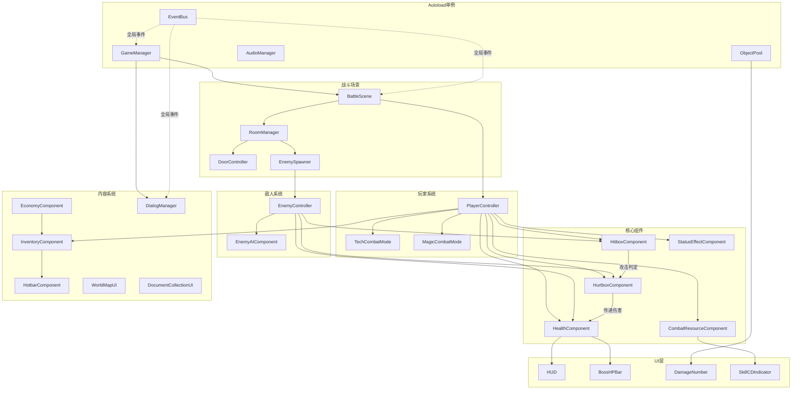

# 需求分析文档

## 1. 系统总览

### 系统清单

| 编号 | 系统 | 优先级 | 复杂度 | 模块组 |
|------|------|--------|--------|--------|
| S01 | EventBus | P0 | 低 | 基础设施 |
| S02 | GameManager | P0 | 中 | 基础设施 |
| S03 | ObjectPool | P0 | 中 | 基础设施 |
| S04 | AudioManager | P1 | 低 | 基础设施 |
| S05 | HealthComponent | P0 | 中 | 核心组件 |
| S06 | HitboxComponent / HurtboxComponent | P0 | 中 | 核心组件 |
| S07 | CombatResourceComponent | P0 | 中 | 核心组件 |
| S08 | StatusEffectComponent | P1 | 中 | 核心组件 |
| S09 | PlayerController | P0 | 高 | 玩家系统 |
| S10 | TechCombatMode / MagicCombatMode | P0 | 高 | 玩家系统 |
| S11 | EnemyController | P0 | 高 | 敌人系统 |
| S12 | EnemyAIComponent | P0 | 中 | 敌人系统 |
| S13 | BattleScene | P0 | 高 | 战斗场景 |
| S14 | RoomManager | P0 | 中 | 战斗场景 |
| S15 | DoorController | P0 | 低 | 战斗场景 |
| S16 | EnemySpawner | P0 | 中 | 战斗场景 |
| S17 | InventoryComponent | P0 | 中 | 内容系统 |
| S18 | HotbarComponent | P0 | 低 | 内容系统 |
| S19 | EconomyComponent | P0 | 低 | 内容系统 |
| S20 | DialogManager | P0 | 高 | 内容系统 |
| S21 | WorldMapUI | P0 | 中 | 内容系统 |
| S22 | DocumentCollectionUI | P1 | 中 | 内容系统 |
| S23 | HUD | P0 | 高 | UI |
| S24 | MainMenuUI | P0 | 低 | UI |
| S25 | PauseMenuUI | P0 | 低 | UI |
| S26 | InventoryUI | P0 | 高 | UI |
| S27 | ShopUI | P1 | 中 | UI |
| S28 | BossHPBar | P0 | 低 | UI |
| S29 | DamageNumber | P1 | 低 | UI |
| S30 | SkillCDIndicator | P0 | 低 | UI |
| S31 | HotbarUI | P0 | 低 | UI |
| S32 | MinimapUI | P1 | 中 | UI |
| S33 | SettingsUI | P1 | 低 | UI |
| S34 | CharacterPanelUI | P1 | 中 | UI |
| S35 | SaveData | P1 | 中 | 基础设施 |

### 模块依赖图



## 2. 架构设计

### 设计原则

1. **一切皆节点**：通过添加子节点组合行为，不增加继承深度。PlayerController 直接继承 CharacterBody2D，功能通过组件子节点组合
2. **信号完整性**：所有跨模块通信使用 `[Signal]` + `EventHandler` 委托，信号必须携带类型化参数
3. **场景独立**：每个场景可独立实例化，不假设父节点或兄弟节点存在
4. **Autoload 纪律**：仅 EventBus、GameManager、ObjectPool、AudioManager 四个 Autoload，不存放游戏逻辑
5. **场景代码构建**：.tscn 只保留空壳（根节点 + 脚本引用），子节点在 C# `BuildScene()` 方法中动态创建

### 架构模式

| 模式 | 应用场景 | C# 实现 |
|------|---------|---------|
| Autoload 单例 | EventBus, GameManager, ObjectPool, AudioManager | `Instance` 静态属性 + `_Ready()` 赋值 |
| 状态机 | PlayerState, EnemyState | `enum` + `switch` |
| 观察者 (Signal) | 战斗事件、UI更新 | `[Signal]` + `EventHandler` + `+=` 订阅 |
| 策略模式 | 阵营差异 | `ICombatMode` 接口 + `TechCombatMode` / `MagicCombatMode` |
| 对象池 | 子弹、伤害数字、掉落物 | `Stack<Node>` + `PackedScene.Instantiate()` |
| 组件模式 | Health, Hitbox, Hurtbox | 作为子节点挂载，不使用继承 |

### 物理层分配

| Layer | 名称 | 用途 |
|-------|------|------|
| 1 | Player Body | 玩家碰撞体 |
| 2 | Player Hitbox | 玩家攻击判定区 |
| 3 | Enemy Body | 敌人碰撞体 |
| 4 | Enemy Hitbox | 敌人攻击判定区 |
| 5 | Dropped Items | 掉落物品 |

碰撞矩阵：Player Hitbox (L2) 检测 Enemy Body (L3)；Enemy Hitbox (L4) 检测 Player Body (L1)。

## 3. 文件结构

```
scripts/
├── autoload/
│   ├── EventBus.cs
│   ├── GameManager.cs
│   ├── ObjectPool.cs
│   └── AudioManager.cs
├── components/
│   ├── HealthComponent.cs
│   ├── HitboxComponent.cs
│   ├── HurtboxComponent.cs
│   ├── CombatResourceComponent.cs
│   ├── StatusEffectComponent.cs
│   ├── InventoryComponent.cs
│   └── HotbarComponent.cs
├── player/
│   ├── PlayerController.cs
│   ├── PlayerStateMachine.cs
│   ├── TechCombatMode.cs
│   └── MagicCombatMode.cs
├── enemy/
│   ├── EnemyController.cs
│   └── EnemyAIComponent.cs
├── systems/
│   ├── battle/
│   │   ├── BattleScene.cs
│   │   ├── RoomManager.cs
│   │   ├── DoorController.cs
│   │   └── EnemySpawner.cs
│   ├── dialog/
│   │   ├── DialogManager.cs
│   │   └── DialogUI.cs
│   ├── world_map/
│   │   └── WorldMapUI.cs
│   ├── document/
│   │   └── DocumentCollectionUI.cs
│   └── economy/
│       └── ShopController.cs
├── ui/
│   ├── HUD.cs
│   ├── MainMenuUI.cs
│   ├── PauseMenuUI.cs
│   ├── InventoryUI.cs
│   ├── ShopUI.cs
│   ├── BossHPBar.cs
│   ├── DamageNumber.cs
│   ├── SkillCDIndicator.cs
│   ├── HotbarUI.cs
│   ├── MinimapUI.cs
│   ├── SettingsUI.cs
│   └── CharacterPanelUI.cs
├── data/
│   ├── Enums.cs
│   ├── CharacterData.cs
│   ├── EnemyData.cs
│   ├── ItemData.cs
│   ├── SkillData.cs
│   ├── DialogData.cs
│   ├── RoomData.cs
│   ├── DocumentData.cs
│   ├── RegionData.cs
│   ├── LootDrop.cs
│   └── SaveData.cs
└── interfaces/
    ├── ICombatMode.cs
    └── IState.cs
```

## 4. 场景树设计

### 4.1 玩家场景树

```
Player (CharacterBody2D) ← PlayerController.cs
├── Sprite (Sprite2D)
├── CollisionShape (CollisionShape2D) [CircleShape2D R=16]
├── HealthComponent (Node) ← HealthComponent.cs
├── HitboxComponent (Area2D) ← HitboxComponent.cs [Layer 2]
│   └── CollisionShape2D
├── HurtboxComponent (Area2D) ← HurtboxComponent.cs [monitor L4]
│   └── CollisionShape2D
├── CombatResourceComponent (Node) ← CombatResourceComponent.cs
├── StatusEffectComponent (Node) ← StatusEffectComponent.cs
└── AnimationPlayer
```

### 4.2 敌人场景树

```
Enemy (CharacterBody2D) ← EnemyController.cs
├── Sprite (Sprite2D)
├── CollisionShape (CollisionShape2D) [Layer 3]
├── HealthComponent (Node) ← HealthComponent.cs
├── HitboxComponent (Area2D) ← HitboxComponent.cs [Layer 4]
│   └── CollisionShape2D
├── HurtboxComponent (Area2D) ← HurtboxComponent.cs [monitor L2]
│   └── CollisionShape2D
├── EnemyAIComponent (Node) ← EnemyAIComponent.cs
└── AnimationPlayer
```

### 4.3 战斗场景树

```
BattleScene (Node2D) ← BattleScene.cs
├── Background (Sprite2D)
├── Decorations (Node2D)
│   └── Decoration_N (StaticBody2D + Sprite2D + CollisionShape2D)
├── Enemies (Node2D)
│   └── (动态生成 EnemyController 实例)
├── Player (CharacterBody2D) ← PlayerController.cs
│   └── (见4.1)
├── Doors (Node2D)
│   ├── Door_0 (Area2D) ← DoorController.cs
│   │   └── CollisionShape2D
│   └── Door_1 ...
├── Items (Node2D)
└── HUD (CanvasLayer) ← HUD.cs
    ├── TopLeft (VBoxContainer)
    │   ├── HPBar (ProgressBar)
    │   ├── ShieldBar (ProgressBar)
    │   └── AmmoCount (Label)
    ├── TopRight (HBoxContainer)
    │   └── CurrencyLabel (Label)
    ├── BottomCenter (HBoxContainer)
    │   ├── SkillSlot_Q (SkillCDIndicator)
    │   ├── SkillSlot_LMB (SkillCDIndicator)
    │   ├── SkillSlot_RMB (SkillCDIndicator)
    │   └── SkillSlot_E (SkillCDIndicator)
    ├── BottomLeft (HotbarUI)
    ├── BottomRight (MinimapUI)
    └── TopCenter (BossHPBar) [默认隐藏]
```

### 4.4 对话场景树

```
DialogUI (Control) ← DialogUI.cs [全屏覆盖]
├── LeftPortrait (TextureRect) [400×800, 左侧]
├── RightPortrait (TextureRect) [400×800, 右侧]
├── TextBox (Panel) [底部全宽×200px]
│   ├── SpeakerName (Label)
│   ├── SpeakerAvatar (TextureRect)
│   ├── DialogText (RichTextLabel)
│   └── ContinueHint (TextureRect)
└── CutsceneOverlay (ColorRect) [过场图片全屏覆盖, 默认隐藏]
    └── CutsceneImage (TextureRect)
```

### 4.5 主菜单场景树

```
MainMenu (Control) ← MainMenuUI.cs [全屏]
├── Background (TextureRect)
├── TitleLabel (Label) ["万物为铜"]
└── ButtonContainer (VBoxContainer)
    ├── StartButton (Button)
    ├── SettingsButton (Button)
    └── QuitButton (Button)
```

## 5. 系统详细设计

### 5.1 EventBus（Autoload）

- **优先级**: P0
- **文件**: `scripts/autoload/EventBus.cs`
- **继承**: `Node`
- **职责**: 全局 C# 事件总线，使用 `static event` 委托，不使用 Godot Signal

```csharp
public partial class EventBus : Node
{
    // 战斗事件
    public static event Action<float, DamageType> OnGlobalDamage;
    public static event Action<string> OnEnemyDefeated;
    public static event Action OnPlayerDied;
    public static event Action<int> OnRoomCleared;
    public static event Action OnBattleComplete;

    // 物品/经济事件
    public static event Action<string, int> OnItemCollected;
    public static event Action<string> OnDocumentCollected;
    public static event Action<float> OnCurrencyChanged;

    // 流程事件
    public static event Action<string> OnDialogRequested;
    public static event Action<string> OnCutsceneRequested;
    public static event Action OnSaveRequested;
    public static event Action<string> OnSceneTransition;

    // 触发方法
    public static void EmitEnemyDefeated(string id) => OnEnemyDefeated?.Invoke(id);
    public static void EmitItemCollected(string id, int count) => OnItemCollected?.Invoke(id, count);
    // ...每个事件对应一个 Emit 方法
}
```

### 5.2 GameManager（Autoload）

- **优先级**: P0
- **文件**: `scripts/autoload/GameManager.cs`
- **继承**: `Node`

```csharp
public enum GameState { MainMenu, Battle, Dialog, WorldMap, Paused, Cutscene }

public partial class GameManager : Node
{
    public static GameManager Instance { get; private set; }

    public GameState CurrentState { get; private set; } = GameState.MainMenu;
    public string CurrentChapter { get; private set; }
    public string CurrentRegion { get; private set; }
    public FactionType ActiveFaction { get; private set; }

    public override void _Ready() { Instance = this; }

    public void ChangeState(GameState newState);
    public void StartNewGame(FactionType faction);
    public void TransitionToBattle(string regionId);
    public void TransitionToWorldMap();
    public void RequestDialog(string dialogId);
    public void PauseGame();
    public void ResumeGame();
    public void RequestSave();
    public void RequestLoad(string savePath);
}
```

### 5.3 ObjectPool（Autoload）

- **优先级**: P0
- **文件**: `scripts/autoload/ObjectPool.cs`
- **继承**: `Node`

```csharp
public partial class ObjectPool : Node
{
    public static ObjectPool Instance { get; private set; }
    private Dictionary<string, Stack<Node>> _pools = new();
    private Dictionary<string, PackedScene> _scenes = new();

    public override void _Ready() { Instance = this; }

    public void Register(string key, PackedScene scene, int preload = 5);
    public T Get<T>(string key) where T : Node;
    public void Return(string key, Node obj);
    public void PreloadAll();
}
```

### 5.4 AudioManager（Autoload）

- **优先级**: P1
- **文件**: `scripts/autoload/AudioManager.cs`
- **继承**: `Node`

```csharp
public partial class AudioManager : Node
{
    public static AudioManager Instance { get; private set; }

    private AudioStreamPlayer _bgmPlayer;
    private AudioStreamPlayer[] _sfxPlayers; // 8个SFX通道
    public const int SfxChannelCount = 8;

    public override void _Ready() { Instance = this; }

    public void PlayBGM(string path, float fadeTime = 1f);
    public void StopBGM(float fadeTime = 1f);
    public void PlaySFX(string path, float volumeDb = 0f);
    public void SetMusicVolume(float linear);
    public void SetSFXVolume(float linear);
}
```

### 5.5 HealthComponent

- **优先级**: P0
- **文件**: `scripts/components/HealthComponent.cs`
- **继承**: `Node`
- **挂载于**: PlayerController, EnemyController

```csharp
[GlobalClass]
public partial class HealthComponent : Node
{
    [Signal] public delegate void HealthChangedEventHandler(float current, float max);
    [Signal] public delegate void ShieldChangedEventHandler(float current, float max);
    [Signal] public delegate void DamagedEventHandler(float rawDamage, DamageType type);
    [Signal] public delegate void HealedEventHandler(float amount);
    [Signal] public delegate void DiedEventHandler();

    [Export] public float MaxHealth { get; set; } = 100f;
    [Export] public float MaxShield { get; set; } = 50f;
    [Export] public float ShieldAbsorbRate { get; set; } = 0.5f;
    [Export] public float ShieldRegenSpeed { get; set; } = 2f;
    [Export] public float ShieldRegenDelay { get; set; } = 3f;

    public float CurrentHealth { get; private set; }
    public float CurrentShield { get; private set; }
    public bool IsDead => CurrentHealth <= 0;

    private bool _invincible;
    private double _lastDamageTime;

    public override void _Ready() { CurrentHealth = MaxHealth; CurrentShield = MaxShield; }

    public override void _Process(double delta)
    {
        // 护盾恢复：ShieldRegenDelay 秒未受击后，每秒恢复 ShieldRegenSpeed
    }

    /// <summary>普通伤害：按 ShieldAbsorbRate 分配到护盾/HP</summary>
    public void ApplyDamage(float amount);
    /// <summary>中毒伤害：直接扣HP，无视护盾</summary>
    public void ApplyPoisonDamage(float amount);
    /// <summary>碎盾伤害：只扣护盾，不扣HP</summary>
    public void ApplyShieldBreak(float amount);
    /// <summary>治疗</summary>
    public void Heal(float amount);
    /// <summary>设置无敌状态（翻滚闪避用）</summary>
    public void SetInvincible(bool enabled);
    /// <summary>重置到满血满盾</summary>
    public void Reset();
}
```

**核心算法 — 伤害分配**：
```
shieldDamage = amount * ShieldAbsorbRate
healthDamage = amount * (1 - ShieldAbsorbRate)
CurrentShield = max(0, CurrentShield - shieldDamage)
CurrentHealth = max(0, CurrentHealth - healthDamage)
if CurrentHealth <= 0 → Emit Died
```

### 5.6 HitboxComponent / HurtboxComponent

- **优先级**: P0
- **文件**: `scripts/components/HitboxComponent.cs`, `scripts/components/HurtboxComponent.cs`
- **继承**: `Area2D`

```csharp
[GlobalClass]
public partial class HitboxComponent : Area2D
{
    [Signal] public delegate void HitEventHandler(HurtboxComponent target);

    [Export] public float Damage { get; set; } = 10f;
    [Export] public float KnockbackForce { get; set; } = 200f;
    [Export] public DamageType DamageType { get; set; } = DamageType.Normal;

    public void SetActive(bool active); // 启用/禁用碰撞检测
    public void SetDamage(float damage);
}

[GlobalClass]
public partial class HurtboxComponent : Area2D
{
    [Signal] public delegate void ReceivedDamageEventHandler(float amount, DamageType type);

    private HealthComponent _health;

    public override void _Ready()
    {
        // 查找兄弟节点 HealthComponent
        // 连接 area_entered 信号到 OnAreaEntered
    }

    private void OnAreaEntered(Area2D area)
    {
        // 检查 area 是否为 HitboxComponent
        // 调用 _health.ApplyDamage(hitbox.Damage)
        // 发射 ReceivedDamage 信号
    }

    public void ReceiveHit(HitboxComponent hitbox);
}
```

**碰撞层设置**：
- 玩家 HitboxComponent：collision_layer = L2, collision_mask = L3
- 敌人 HurtboxComponent：collision_layer = L3, collision_mask = L2
- 敌人 HitboxComponent：collision_layer = L4, collision_mask = L1
- 玩家 HurtboxComponent：collision_layer = L1, collision_mask = L4

### 5.7 CombatResourceComponent

- **优先级**: P0
- **文件**: `scripts/components/CombatResourceComponent.cs`
- **继承**: `Node`
- **挂载于**: PlayerController

```csharp
[GlobalClass]
public partial class CombatResourceComponent : Node
{
    [Signal] public delegate void AmmoChangedEventHandler(int current, int max);
    [Signal] public delegate void ChargeChangedEventHandler(float progress);
    [Signal] public delegate void SkillCooldownUpdatedEventHandler(int slot, float remaining, float total);

    [Export] public FactionType Faction { get; set; }
    // 科技系
    [Export] public int MaxAmmo { get; set; } = 30;
    [Export] public float ReloadTime { get; set; } = 1.5f;
    // 魔法系
    [Export] public float ChargeTime { get; set; } = 2f;
    [Export] public float CdAcceleration { get; set; } = 1f;

    public int CurrentAmmo { get; private set; }
    public float ChargeProgress { get; private set; }
    public bool IsCharging { get; private set; }
    public bool IsReloading { get; private set; }

    // 技能CD：slot 0=Q, 1=左键, 2=右键, 3=E
    private float[] _skillCooldowns = new float[4];
    private float[] _skillMaxCooldowns = new float[4];

    public override void _Process(double delta);
    public void ConsumeAmmo(int count);
    public void Reload();
    public void StartCharge();
    public void CancelCharge();
    public float GetChargeProgress();
    public void UseSkill(int slot, float cooldown);
    public bool IsSkillReady(int slot);
    public float GetSkillCooldown(int slot);
}
```

### 5.8 StatusEffectComponent

- **优先级**: P1
- **文件**: `scripts/components/StatusEffectComponent.cs`
- **继承**: `Node`

```csharp
public enum StatusEffectType { Poison, Stun, Burn }

[GlobalClass]
public partial class StatusEffectComponent : Node
{
    [Signal] public delegate void EffectAppliedEventHandler(StatusEffectType type, float duration);
    [Signal] public delegate void EffectRemovedEventHandler(StatusEffectType type);

    private Dictionary<StatusEffectType, (float remaining, float tickDmg, float tickInterval, float tickTimer)> _effects = new();

    public void ApplyEffect(StatusEffectType type, float duration, float tickDamage = 0f, float tickInterval = 1f);
    public void RemoveEffect(StatusEffectType type);
    public bool HasEffect(StatusEffectType type);
    public void ClearAll();
}
```

### 5.9 PlayerController

- **优先级**: P0
- **文件**: `scripts/player/PlayerController.cs`
- **继承**: `CharacterBody2D`

```csharp
public enum PlayerState { Idle, Moving, Attacking, Rolling, Casting, Interacting, Dead }

[GlobalClass]
public partial class PlayerController : CharacterBody2D
{
    // 子节点引用（BuildScene创建）
    private Sprite2D _sprite;
    private CollisionShape2D _collision;
    public HealthComponent Health { get; private set; }
    public HitboxComponent Hitbox { get; private set; }
    public HurtboxComponent Hurtbox { get; private set; }
    public CombatResourceComponent CombatResource { get; private set; }
    public StatusEffectComponent StatusEffect { get; private set; }
    private AnimationPlayer _anim;

    // 配置
    [Export] public CharacterData Data { get; set; }
    [Export] public float RollSpeed { get; set; } = 400f;
    [Export] public float RollDuration { get; set; } = 0.3f;
    [Export] public float RollCooldown { get; set; } = 0.5f;

    // 状态
    public PlayerState CurrentState { get; private set; }
    public ICombatMode CombatMode { get; private set; }
    public Vector2 FacingDirection { get; private set; } = Vector2.Right;

    // 内部状态
    private float _rollTimer;
    private float _rollCooldownTimer;
    private Vector2 _rollDirection;
    private Vector2 _inputDirection;

    public override void _Ready() { BuildScene(); Initialize(); }
    public override void _PhysicsProcess(double delta);
    public override void _UnhandledInput(InputEvent ev);

    public void ChangeState(PlayerState newState);
    public void SetFaction(FactionType faction);
    public void TakeDamage(float amount);
    public void Interact();

    private void BuildScene();  // 创建所有子节点
    private void Initialize();  // 从 CharacterData 初始化属性
    private void HandleMovement(double delta);
    private void HandleRoll();
    private void HandleInteraction();
    private void UpdateAnimation();
}
```

**核心算法 — 状态机**：
```
_PhysicsProcess:
  if Dead → return
  HandleMovement(delta)
  HandleRoll()
  CombatMode.Update(this, delta)
  MoveAndSlide()
  UpdateAnimation()

UnhandledInput:
  左键 → CombatMode.HandleAttack(this)
  右键 → CombatMode.HandleUltimate(this)
  Q → CombatMode.HandleSkill1(this)
  E → CombatMode.HandleSkill2(this)
  R → CombatMode.HandleSpecialAction(this)
  空格 → HandleRoll()
  F → Interact()
  1234 → HotbarComponent.UseSlot(n)
```

### 5.10 ICombatMode 接口与阵营实现

- **优先级**: P0
- **文件**: `scripts/interfaces/ICombatMode.cs`, `scripts/player/TechCombatMode.cs`, `scripts/player/MagicCombatMode.cs`

```csharp
public interface ICombatMode
{
    void HandleAttack(PlayerController player);
    void HandleSpecialAction(PlayerController player);
    void HandleSkill1(PlayerController player);
    void HandleSkill2(PlayerController player);
    void HandleUltimate(PlayerController player);
    void Update(PlayerController player, double delta);
}
```

**TechCombatMode（罗兰/科技系）**：
```
HandleAttack:
  if CurrentAmmo > 0:
    近战：激活 HitboxComponent.SetActive(true)，短时间后关闭
    远程：从 ObjectPool 取子弹实例，设置方向，消耗弹药
  else: 播放空弹音效

HandleSpecialAction (R键):
  if !IsReloading:
    开始换弹计时器，完成后 CurrentAmmo = MaxAmmo

Update:
  无额外逻辑（科技系不限制移动）
```

**MagicCombatMode（薇/魔法系）**：
```
HandleAttack:
  if !IsCharging && IsSkillReady(1):
    player.ChangeState(Casting)
    StartCharge()

Update:
  if IsCharging:
    if player.Velocity != Vector2.Zero:
      CancelCharge()  // 移动中断蓄力
      player.ChangeState(Idle)
    else:
      ChargeProgress += delta / ChargeTime
      if ChargeProgress >= 1.0:
        释放技能，ApplyDamage in range
        CancelCharge()
        player.ChangeState(Idle)

HandleSpecialAction (R键):
  CdAcceleration 生效，加速所有技能CD
```

### 5.11 EnemyController

- **优先级**: P0
- **文件**: `scripts/enemy/EnemyController.cs`
- **继承**: `CharacterBody2D`

```csharp
public enum EnemyState { Idle, Patrol, Chase, Attack, Stunned, Dead }

[GlobalClass]
public partial class EnemyController : CharacterBody2D
{
    public HealthComponent Health { get; private set; }
    public HitboxComponent Hitbox { get; private set; }
    public HurtboxComponent Hurtbox { get; private set; }
    public EnemyAIComponent AI { get; private set; }
    private Sprite2D _sprite;
    private AnimationPlayer _anim;

    [Export] public EnemyData Data { get; set; }
    public EnemyState CurrentState { get; private set; }
    public Vector2 SpawnPosition { get; set; }
    public CharacterBody2D Target { get; set; }

    // 狂暴状态
    public bool IsBerserk { get; private set; }

    public override void _Ready() { BuildScene(); Initialize(); }
    public override void _PhysicsProcess(double delta);

    public void ChangeState(EnemyState newState);
    public void Initialize(); // 从 EnemyData 初始化
    public void SetTarget(CharacterBody2D target);
    private void OnDamaged(float amount);
    private void OnDeath();
    private void CheckBerserk();
    private void BuildScene();
}
```

### 5.12 EnemyAIComponent

- **优先级**: P0
- **文件**: `scripts/enemy/EnemyAIComponent.cs`
- **继承**: `Node`

```csharp
[GlobalClass]
public partial class EnemyAIComponent : Node
{
    [Export] public float DetectRange { get; set; } = 300f;
    [Export] public float AttackRange { get; set; } = 50f;
    [Export] public float ChaseSpeed { get; set; } = 150f;
    [Export] public float PatrolSpeed { get; set; } = 80f;
    [Export] public float AttackCooldown { get; set; } = 1f;

    private EnemyController _owner;
    private float _attackCooldownTimer;

    public void Initialize(EnemyController owner);
    public Vector2 CalculateVelocity();
    public bool IsTargetInDetectRange();
    public bool IsTargetInAttackRange();
    public bool CanAttack();
}
```

**AI行为逻辑**：
```
每帧:
  if target == null or target.IsDead → Idle
  if distance > DetectRange → Patrol (随机巡逻)
  if distance > AttackRange → Chase (向目标移动)
  if distance <= AttackRange && CanAttack → Attack
```

### 5.13 BattleScene

- **优先级**: P0
- **文件**: `scripts/systems/battle/BattleScene.cs`
- **继承**: `Node2D`

```csharp
[GlobalClass]
public partial class BattleScene : Node2D
{
    private Node2D _background;
    private Node2D _decorations;
    private Node2D _enemies;
    private PlayerController _player;
    private Node2D _doors;
    private Node2D _items;
    private CanvasLayer _hud;

    public RoomManager RoomManager { get; private set; }
    public PlayerController Player => _player;

    [Export] public PackedScene PlayerScene { get; set; }

    public override void _Ready() { BuildScene(); }

    public void LoadRoom(int roomIndex);
    public void OnRoomCleared();
    public void OnBattleComplete();
    private void SpawnEnemiesForRoom(RoomData room);
    private void SpawnDecorationsForRoom(RoomData room);
    private void SpawnDoorsForRoom(RoomData room);
    private void BuildScene();
}
```

### 5.14 RoomManager

- **优先级**: P0
- **文件**: `scripts/systems/battle/RoomManager.cs`
- **继承**: `Node`

```csharp
[GlobalClass]
public partial class RoomManager : Node
{
    [Signal] public delegate void RoomClearedEventHandler(int roomIndex);
    [Signal] public delegate void AllRoomsClearedEventHandler();

    [Export] public RoomData[] Rooms { get; set; }
    public int CurrentRoomIndex { get; private set; }
    public RoomData CurrentRoom => Rooms[CurrentRoomIndex];
    public int TotalRooms => Rooms.Length;

    public void Initialize(BattleScene scene);
    public void AdvanceToNext();
    public bool CheckHiddenRoomCondition(string condition);
    private void OnEnemyDefeated(string enemyId);
}
```

### 5.15 DoorController

- **优先级**: P0
- **文件**: `scripts/systems/battle/DoorController.cs`
- **继承**: `Area2D`

```csharp
[GlobalClass]
public partial class DoorController : Area2D
{
    [Signal] public delegate void DoorEnteredEventHandler(int targetRoomIndex);

    [Export] public bool IsLocked { get; set; } = true;
    [Export] public int TargetRoomIndex { get; set; }

    public void Unlock();
    public void Lock();
}
```

### 5.16 EnemySpawner

- **优先级**: P0
- **文件**: `scripts/systems/battle/EnemySpawner.cs`
- **继承**: `Node`

```csharp
[GlobalClass]
public partial class EnemySpawner : Node
{
    [Signal] public delegate void AllEnemiesDefeatedEventHandler();

    private List<EnemyController> _activeEnemies = new();

    public void SpawnWave(SpawnPoint[] spawns);
    public void ClearAll();
    public int RemainingCount => _activeEnemies.Count;
    private void OnEnemyDeath();
}
```

### 5.17 InventoryComponent

- **优先级**: P0
- **文件**: `scripts/components/InventoryComponent.cs`
- **继承**: `Node`

```csharp
[GlobalClass]
public partial class InventoryComponent : Node
{
    [Signal] public delegate void ItemAddedEventHandler(string itemId, int count);
    [Signal] public delegate void ItemRemovedEventHandler(string itemId, int count);
    [Signal] public delegate void InventoryChangedEventHandler();

    [Export] public Vector2I GridSize { get; set; } = new(10, 8);
    [Export] public int BonusSlots { get; set; } = 0;

    private bool[,] _grid; // true = 已占用
    private Dictionary<string, List<(Vector2I pos, ItemData data)>> _items;

    public override void _Ready() { _grid = new bool[GridSize.X + BonusSlots, GridSize.Y]; }

    public bool TryAddItem(ItemData item, out Vector2I placedAt);
    public bool TryRemoveItem(string itemId, int count = 1);
    public bool TryMoveItem(string itemId, Vector2I newPos);
    public bool HasSpace(ItemData item);
    public int GetItemCount(string itemId);
    public List<(string itemId, Vector2I pos, int count)> GetAllItems();
}
```

**核心算法 — 网格放置（类暗黑2）**：
```
TryAddItem(item):
  遍历 _grid 从 (0,0) 开始
  对每个位置 (x, y):
    检查从 (x,y) 到 (x+item.SpaceOccupied.X, y+item.SpaceOccupied.Y) 的区域是否全部空闲
    如果空闲 → 标记占用，记录物品位置，return true
  return false (背包满)
```

### 5.18 HotbarComponent

- **优先级**: P0
- **文件**: `scripts/components/HotbarComponent.cs`
- **继承**: `Node`

```csharp
[GlobalClass]
public partial class HotbarComponent : Node
{
    [Signal] public delegate void SlotChangedEventHandler(int index, string itemId, int count);
    [Signal] public delegate void ItemUsedEventHandler(int index);

    public const int SlotCount = 4;
    private (string itemId, int count)[] _slots = new (string, int)[SlotCount];

    public bool SetSlot(int index, string itemId, int count);
    public void ClearSlot(int index);
    public void UseSlot(int index);
    public (string itemId, int count) GetSlot(int index);
}
```

### 5.19 EconomyComponent

- **优先级**: P0
- **文件**: `scripts/components/EconomyComponent.cs`
- **继承**: `Node`

```csharp
[GlobalClass]
public partial class EconomyComponent : Node
{
    [Signal] public delegate void CurrencyChangedEventHandler(float current);

    public float CurrentCurrency { get; private set; }

    public void AddCurrency(float amount);
    public bool TrySpend(float amount);
    public bool CanAfford(float amount);
}
```

### 5.20 DialogManager

- **优先级**: P0
- **文件**: `scripts/systems/dialog/DialogManager.cs`
- **继承**: `Node`

```csharp
public enum DialogLayout { SideBySide, Monologue }

[GlobalClass]
public partial class DialogManager : Node
{
    [Signal] public delegate void DialogStartedEventHandler(string dialogId);
    [Signal] public delegate void DialogAdvancedEventHandler(int entryIndex);
    [Signal] public delegate void DialogEndedEventHandler(string dialogId);
    [Signal] public delegate void CutsceneTriggeredEventHandler(string cutsceneId);

    private DialogData _currentDialog;
    private int _currentEntryIndex;
    private bool _isActive;

    public bool IsActive => _isActive;
    public DialogEntry CurrentEntry => _currentDialog?.Entries[_currentEntryIndex];

    public void StartDialog(DialogData data);
    public void Advance();
    public void Skip();
    public DialogLayout GetCurrentLayout();
}
```

### 5.21 DialogUI

- **优先级**: P0
- **文件**: `scripts/systems/dialog/DialogUI.cs`
- **继承**: `Control`

```csharp
[GlobalClass]
public partial class DialogUI : Control
{
    private TextureRect _leftPortrait;
    private TextureRect _rightPortrait;
    private Panel _textBox;
    private RichTextLabel _dialogText;
    private Label _speakerName;
    private TextureRect _speakerAvatar;
    private TextureButton _continueButton;
    private ColorRect _cutsceneOverlay;
    private TextureRect _cutsceneImage;

    public override void _Ready() { BuildScene(); }

    public void ShowEntry(DialogEntry entry);
    public void SetPortrait(string speakerId, Texture2D portrait, bool isLeft);
    public void ShowCutscene(Texture2D image);
    public void HideCutscene();
    public void Clear();
    private void BuildScene();
}
```

### 5.22 WorldMapUI

- **优先级**: P0
- **文件**: `scripts/systems/world_map/WorldMapUI.cs`
- **继承**: `Control`

```csharp
[GlobalClass]
public partial class WorldMapUI : Control
{
    [Signal] public delegate void RegionSelectedEventHandler(string regionId);

    [Export] public RegionData[] Regions { get; set; }

    public override void _Ready() { BuildScene(); }
    public void RefreshUnlocked();
    private void BuildScene();
}
```

### 5.23 DocumentCollectionUI

- **优先级**: P1
- **文件**: `scripts/systems/document/DocumentCollectionUI.cs`
- **继承**: `Control`

```csharp
[GlobalClass]
public partial class DocumentCollectionUI : Control
{
    [Signal] public delegate void DocumentSelectedEventHandler(string docId);

    private HashSet<string> _collectedIds;

    public override void _Ready() { BuildScene(); }
    public void RefreshCollection();
    public void ShowDocument(string docId);
    public void OnDocumentCollected(string docId);
    private void BuildScene();
}
```

### 5.24 ShopController

- **优先级**: P1
- **文件**: `scripts/systems/economy/ShopController.cs`
- **继承**: `Node`

```csharp
[GlobalClass]
public partial class ShopController : Node
{
    [Signal] public delegate void PurchaseCompletedEventHandler(string itemId);
    [Signal] public delegate void PurchaseFailedEventHandler(string reason);

    private EconomyComponent _buyerEconomy;
    private InventoryComponent _buyerInventory;

    public void Open(ItemData[] shopItems, EconomyComponent economy, InventoryComponent inventory);
    public bool TryPurchase(ItemData item);
    public void Close();
}
```

### 5.25 HUD

- **优先级**: P0
- **文件**: `scripts/ui/HUD.cs`
- **继承**: `CanvasLayer`

```csharp
[GlobalClass]
public partial class HUD : CanvasLayer
{
    private ProgressBar _hpBar;
    private ProgressBar _shieldBar;
    private Label _ammoLabel;
    private HBoxContainer _skillBar;
    private HotbarUI _hotbar;
    private Label _currencyLabel;
    private MinimapUI _minimap;
    private BossHPBar _bossHPBar;
    private DamageNumber _damageNumberTemplate;

    public override void _Ready() { BuildScene(); }

    public void BindPlayer(PlayerController player);
    public void ShowBossHP(string name, HealthComponent health);
    public void HideBossHP();
    public void SpawnDamageNumber(float amount, Vector2 worldPos, bool isCritical);
    public void UpdateCurrency(float amount);
    private void BuildScene();
}
```

### 5.26 MainMenuUI

- **优先级**: P0
- **文件**: `scripts/ui/MainMenuUI.cs`
- **继承**: `Control`

```csharp
[GlobalClass]
public partial class MainMenuUI : Control
{
    [Signal] public delegate void StartGamePressedEventHandler();
    [Signal] public delegate void SettingsPressedEventHandler();
    [Signal] public delegate void QuitPressedEventHandler();

    public override void _Ready() { BuildScene(); }
    private void BuildScene();
}
```

### 5.27 PauseMenuUI

- **优先级**: P0
- **文件**: `scripts/ui/PauseMenuUI.cs`
- **继承**: `Control`

```csharp
[GlobalClass]
public partial class PauseMenuUI : Control
{
    [Signal] public delegate void ResumePressedEventHandler();
    [Signal] public delegate void SettingsPressedEventHandler();
    [Signal] public delegate void MainMenuPressedEventHandler();

    public override void _Ready() { BuildScene(); }
    private void BuildScene();
}
```

### 5.28 InventoryUI

- **优先级**: P0
- **文件**: `scripts/ui/InventoryUI.cs`
- **继承**: `Control`

```csharp
[GlobalClass]
public partial class InventoryUI : Control
{
    [Signal] public delegate void ItemSelectedEventHandler(string itemId);
    [Signal] public delegate void ItemMovedEventHandler(string itemId, Vector2I from, Vector2I to);
    [Signal] public delegate void ClosedEventHandler();

    private GridContainer _itemGrid;
    private Panel _detailPanel;
    private HotbarUI _hotbarDisplay;
    private Label _currencyLabel;

    public override void _Ready() { BuildScene(); }
    public void Refresh(InventoryComponent inventory);
    public void ShowItemDetail(ItemData item);
    private void BuildScene();
}
```

### 5.29 其余UI类

BossHPBar, DamageNumber, SkillCDIndicator, HotbarUI, MinimapUI, ShopUI, SettingsUI, CharacterPanelUI
均遵循相同模式：继承对应 Godot 控件节点，`BuildScene()` 构建子节点，信号驱动数据更新。

```csharp
// BossHPBar - scripts/ui/BossHPBar.cs : Control
// public void Initialize(string name, HealthComponent health);
// 监听 health.HealthChanged + health.ShieldChanged 更新进度条

// DamageNumber - scripts/ui/DamageNumber.cs : Label
// public void ShowDamage(float amount, bool isCritical, Vector2 pos);
// 动画：向上飘动+淡出，完成后 ObjectPool.Return

// SkillCDIndicator - scripts/ui/SkillCDIndicator.cs : Control
// public void SetSkill(SkillData skill);
// public void UpdateCooldown(float remaining, float total);

// HotbarUI - scripts/ui/HotbarUI.cs : Control
// public void RefreshSlot(int index, string itemId, int count);

// MinimapUI - scripts/ui/MinimapUI.cs : Control
// public void UpdatePlayerPosition(Vector2 pos);

// ShopUI - scripts/ui/ShopUI.cs : Control
// public void OpenShop(ItemData[] items, EconomyComponent eco, InventoryComponent inv);

// SettingsUI - scripts/ui/SettingsUI.cs : Control
// 音乐/SFX音量滑块，分辨率选择

// CharacterPanelUI - scripts/ui/CharacterPanelUI.cs : Control
// public void ShowStats(CharacterData data, HealthComponent health);
```

## 6. 数据结构汇总

### 6.1 枚举定义（`scripts/data/Enums.cs`）

```csharp
public enum FactionType { Tech, Magic }
public enum DamageType { Normal, Poison, ShieldBreak }
public enum ItemCategory { Consumable, Equipment, Material, Document, KeyItem }
public enum ItemRarity { Common, Rare, EpicRare }
public enum EnemyType { Normal, Elite, Boss }
public enum RoomType { Normal, Elite, Boss, Hidden }
public enum BattleType { Tutorial, Defense, Stealth, Collect, Puzzle, Dialog }
public enum DocumentType { Newspaper, Diary, Research, MilitaryOrder, GovernmentArchive }
```

### 6.2 CharacterData（`scripts/data/CharacterData.cs`）

```csharp
[GlobalClass]
public partial class CharacterData : Resource
{
    [Export] public string CharacterId { get; set; }
    [Export] public string DisplayName { get; set; } = "";
    [Export] public float MaxHealth { get; set; } = 100f;
    [Export] public float MaxShield { get; set; } = 50f;
    [Export] public float ShieldAbsorbRate { get; set; } = 0.5f;
    [Export] public float ShieldRegenSpeed { get; set; } = 2f;
    [Export] public float ShieldRegenDelay { get; set; } = 3f;
    [Export] public float MoveSpeed { get; set; } = 200f;
    [Export] public float RollSpeed { get; set; } = 400f;
    [Export] public float RollDuration { get; set; } = 0.3f;
    [Export] public float RollCooldown { get; set; } = 0.5f;
    [Export] public FactionType Faction { get; set; }
    [Export] public int MaxAmmo { get; set; } = 30;
    [Export] public float ReloadTime { get; set; } = 1.5f;
    [Export] public float ChargeTime { get; set; } = 2f;
    [Export] public float CdAcceleration { get; set; } = 1f;
    [Export] public SkillData[] Skills { get; set; }
    [Export] public int InventoryBonus { get; set; } = 0;
    [Export] public Texture2D PortraitDefault { get; set; }
    [Export] public Texture2D[] PortraitExpressions { get; set; }
}
```

### 6.3 EnemyData（`scripts/data/EnemyData.cs`）

```csharp
[GlobalClass]
public partial class EnemyData : Resource
{
    [Export] public string EnemyId { get; set; }
    [Export] public string DisplayName { get; set; } = "";
    [Export] public EnemyType Type { get; set; }
    [Export] public float MaxHealth { get; set; } = 100f;
    [Export] public float MaxShield { get; set; } = 30f;
    [Export] public float AttackPower { get; set; } = 10f;
    [Export] public float MoveSpeed { get; set; } = 150f;
    [Export] public float DetectRange { get; set; } = 300f;
    [Export] public float AttackRange { get; set; } = 50f;
    [Export] public Texture2D Sprite { get; set; }
    [Export] public bool HasBerserk { get; set; }
    [Export] public float BerserkThreshold { get; set; } = 0.3f;
    [Export] public bool HasPoison { get; set; }
    [Export] public float PoisonDamage { get; set; } = 0f;
    [Export] public bool CanSummon { get; set; }
    [Export] public EnemyData SummonType { get; set; }
    [Export] public LootDrop[] LootTable { get; set; }
}
```

### 6.4 ItemData（`scripts/data/ItemData.cs`）

```csharp
[GlobalClass]
public partial class ItemData : Resource
{
    [Export] public string ItemId { get; set; }
    [Export] public string DisplayName { get; set; } = "";
    [Export] public string Description { get; set; } = "";
    [Export] public Texture2D Icon { get; set; }
    [Export] public Vector2I SpaceOccupied { get; set; } = new(1, 1);
    [Export] public ItemCategory Category { get; set; }
    [Export] public ItemRarity Rarity { get; set; }
    [Export] public int MaxStack { get; set; } = 99;
    [Export] public float BuyPrice { get; set; } = 0f;
    [Export] public float SellPrice { get; set; } = 0f;
    [Export] public string UseEffectId { get; set; }
}
```

### 6.5 SkillData（`scripts/data/SkillData.cs`）

```csharp
[GlobalClass]
public partial class SkillData : Resource
{
    [Export] public string SkillId { get; set; }
    [Export] public string DisplayName { get; set; } = "";
    [Export] public Texture2D Icon { get; set; }
    [Export] public float Cooldown { get; set; } = 5f;
    [Export] public float Damage { get; set; } = 20f;
    [Export] public float Range { get; set; } = 100f;
    [Export] public float Duration { get; set; } = 0.5f;
    [Export] public bool RequiresAim { get; set; } = true;
}
```

### 6.6 DialogData（`scripts/data/DialogData.cs`）

```csharp
[GlobalClass]
public partial class DialogData : Resource
{
    [Export] public string DialogId { get; set; }
    [Export] public DialogEntry[] Entries { get; set; }
}

[GlobalClass]
public partial class DialogEntry : Resource
{
    [Export] public string SpeakerId { get; set; }
    [Export] public string Text { get; set; } = "";
    [Export] public string PortraitExpression { get; set; } = "default";
    [Export] public DialogLayout Layout { get; set; } = DialogLayout.SideBySide;
    [Export] public string CutsceneId { get; set; } = "";
    [Export] public float CutsceneDelay { get; set; } = 0f;
}
```

### 6.7 RoomData（`scripts/data/RoomData.cs`）

```csharp
[GlobalClass]
public partial class RoomData : Resource
{
    [Export] public string RoomId { get; set; }
    [Export] public RoomType Type { get; set; }
    [Export] public BattleType BattleType { get; set; }
    [Export] public Vector2I RoomSize { get; set; } = new(1920, 1080);
    [Export] public Texture2D Background { get; set; }
    [Export] public SpawnPoint[] SpawnPoints { get; set; }
    [Export] public DoorPosition[] Doors { get; set; }
    [Export] public Decoration[] Decorations { get; set; }
    [Export] public string HiddenCondition { get; set; } = "";
}

[GlobalClass]
public partial class SpawnPoint : Resource
{
    [Export] public Vector2 Position { get; set; }
    [Export] public EnemyData Enemy { get; set; }
}

[GlobalClass]
public partial class DoorPosition : Resource
{
    [Export] public Vector2 Position { get; set; }
    [Export] public int TargetRoomIndex { get; set; } = -1;
}

[GlobalClass]
public partial class Decoration : Resource
{
    [Export] public Vector2 Position { get; set; }
    [Export] public Texture2D Sprite { get; set; }
    [Export] public bool HasCollision { get; set; }
    [Export] public Vector2 CollisionSize { get; set; }
}
```

### 6.8 DocumentData（`scripts/data/DocumentData.cs`）

```csharp
[GlobalClass]
public partial class DocumentData : Resource
{
    [Export] public string DocumentId { get; set; }
    [Export] public string Title { get; set; } = "";
    [Export] public string Content { get; set; } = "";
    [Export] public DocumentType Type { get; set; }
    [Export] public ItemRarity Rarity { get; set; }
    [Export] public string TimePeriod { get; set; }
    [Export] public Texture2D Image { get; set; }
}
```

### 6.9 RegionData（`scripts/data/RegionData.cs`）

```csharp
[GlobalClass]
public partial class RegionData : Resource
{
    [Export] public string RegionId { get; set; }
    [Export] public string DisplayName { get; set; } = "";
    [Export] public Texture2D MapImage { get; set; }
    [Export] public bool IsUnlocked { get; set; }
    [Export] public string UnlockCondition { get; set; } = "";
    [Export] public Vector2 MapPosition { get; set; }
    [Export] public RoomData[] Rooms { get; set; }
}
```

### 6.10 LootDrop（`scripts/data/LootDrop.cs`）

```csharp
[GlobalClass]
public partial class LootDrop : Resource
{
    [Export] public ItemData Item { get; set; }
    [Export] public float DropChance { get; set; } = 0.5f;
    [Export] public int MinCount { get; set; } = 1;
    [Export] public int MaxCount { get; set; } = 1;
}
```

### 6.11 SaveData（`scripts/data/SaveData.cs`）

```csharp
[GlobalClass]
public partial class SaveData : Resource
{
    [Export] public string CurrentChapter { get; set; }
    [Export] public string CurrentRegion { get; set; }
    [Export] public FactionType ActiveFaction { get; set; }
    [Export] public float PlayerHealth { get; set; }
    [Export] public float PlayerShield { get; set; }
    [Export] public float Currency { get; set; }
    [Export] public string[] InventoryItems { get; set; }
    [Export] public string[] CollectedDocuments { get; set; }
    [Export] public string[] UnlockedRegions { get; set; }
    [Export] public int CompletedRooms { get; set; }

    public Error SaveToFile(string path);
    public static SaveData LoadFromFile(string path);
}
```

## 7. Autoload 单例清单

| 单例 | 文件 | 职责 | 生命周期 |
|------|------|------|---------|
| EventBus | autoload/EventBus.cs | C# static event 全局事件总线 | 全局 |
| GameManager | autoload/GameManager.cs | 游戏状态机、场景切换、流程控制 | 全局 |
| ObjectPool | autoload/ObjectPool.cs | 对象池（子弹、伤害数字、掉落物） | 全局 |
| AudioManager | autoload/AudioManager.cs | BGM/SFX 播放、音量控制、跨场景音乐 | 全局 |

**project.godot [autoload] 配置**：
```ini
[autoload]
EventBus="*res://scripts/autoload/EventBus.cs"
GameManager="*res://scripts/autoload/GameManager.cs"
ObjectPool="*res://scripts/autoload/ObjectPool.cs"
AudioManager="*res://scripts/autoload/AudioManager.cs"
```

## 8. 开发里程碑

### 阶段1：基础框架（依赖：无）

| 任务 | 文件 | 说明 |
|------|------|------|
| EventBus | autoload/EventBus.cs | 全局事件总线 |
| GameManager | autoload/GameManager.cs | 状态机 + 场景切换 |
| ObjectPool | autoload/ObjectPool.cs | 通用对象池 |
| HealthComponent | components/HealthComponent.cs | HP/护盾/伤害分配 |
| HitboxComponent | components/HitboxComponent.cs | 攻击判定 |
| HurtboxComponent | components/HurtboxComponent.cs | 受伤接收 |
| PlayerController | player/PlayerController.cs | 基础移动 + 状态机 + BuildScene |

### 阶段2：核心战斗（依赖：阶段1）

| 任务 | 文件 | 说明 |
|------|------|------|
| CombatResourceComponent | components/CombatResourceComponent.cs | 子弹/蓄力/技能CD |
| TechCombatMode | player/TechCombatMode.cs | 科技系操作 |
| MagicCombatMode | player/MagicCombatMode.cs | 魔法系操作 |
| StatusEffectComponent | components/StatusEffectComponent.cs | 中毒/眩晕/灼烧 |
| EnemyController | enemy/EnemyController.cs | 敌人基础 + BuildScene |
| EnemyAIComponent | enemy/EnemyAIComponent.cs | AI行为（巡逻/追击/攻击） |
| BossHPBar | ui/BossHPBar.cs | Boss血条 |
| DamageNumber | ui/DamageNumber.cs | 浮动伤害数字 |

### 阶段3：内容系统（依赖：阶段2）

| 任务 | 文件 | 说明 |
|------|------|------|
| BattleScene | systems/battle/BattleScene.cs | 战斗场景根 + BuildScene |
| RoomManager | systems/battle/RoomManager.cs | 房间推进 |
| DoorController | systems/battle/DoorController.cs | 房间门控制 |
| EnemySpawner | systems/battle/EnemySpawner.cs | 敌人刷新 |
| InventoryComponent | components/InventoryComponent.cs | 网格背包 |
| HotbarComponent | components/HotbarComponent.cs | 快捷栏 |
| EconomyComponent | components/EconomyComponent.cs | 货币系统 |
| DialogManager | systems/dialog/DialogManager.cs | 对话管理 |
| DialogUI | systems/dialog/DialogUI.cs | 对话界面 |

### 阶段4：UI与扩展（依赖：阶段3）

| 任务 | 文件 | 说明 |
|------|------|------|
| HUD | ui/HUD.cs | 战斗HUD总控 |
| MainMenuUI | ui/MainMenuUI.cs | 主菜单 |
| PauseMenuUI | ui/PauseMenuUI.cs | 暂停菜单 |
| InventoryUI | ui/InventoryUI.cs | 背包界面 |
| ShopUI + ShopController | ui/ShopUI.cs + systems/economy/ShopController.cs | 商店 |
| SkillCDIndicator | ui/SkillCDIndicator.cs | 技能CD显示 |
| HotbarUI | ui/HotbarUI.cs | 快捷栏UI |
| WorldMapUI | systems/world_map/WorldMapUI.cs | 大地图 |
| DocumentCollectionUI | systems/document/DocumentCollectionUI.cs | 文献收集 |
| SettingsUI | ui/SettingsUI.cs | 设置界面 |
| CharacterPanelUI | ui/CharacterPanelUI.cs | 角色面板 |
| MinimapUI | ui/MinimapUI.cs | 小地图 |
| AudioManager | autoload/AudioManager.cs | 音频集成 |
| SaveData | data/SaveData.cs | 存档系统 |
