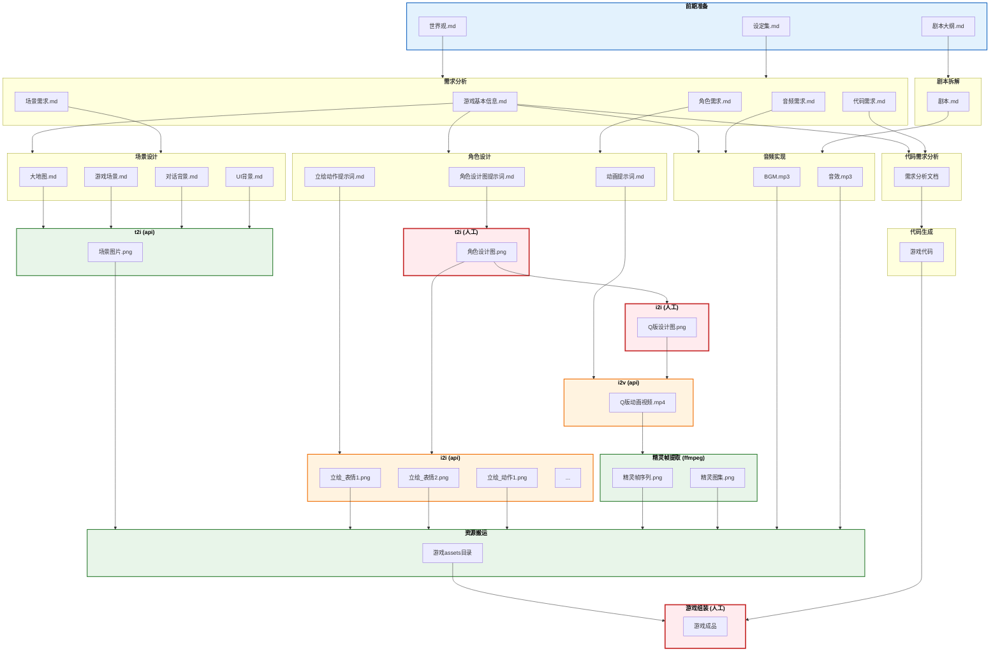

# 万物为铜 - 游戏开发流程图



---

## 图例说明

| 样式 | 含义 | 示例环节 |
|------|------|---------|
| 🔴 红色边框 | 纯人工处理 | t2i(人工)、i2i(人工)、游戏组装 |
| 🟠 橙色边框 | AI辅助（需人工参与） | i2i(图片)、i2v(api) |
| 🟢 绿色边框 | 自动化处理 | t2i(api)、精灵帧提取、资源搬运 |
| 🔵 蓝色边框 | 前期准备（输入资料） | 世界观、设定集、剧本大纲 |

## 名词解释

| 术语 | 全称 | 含义 |
|------|------|------|
| t2i | Text to Image | 文字生成图片 |
| i2i | Image to Image | 图片生成图片 |
| i2v | Image to Video | 图片生成视频 |

---

## 美术资源生产管线

### 角色美术流程

```
角色设计图提示词.md ──→ t2i (人工) ──→ 角色设计图.png
        │
        └────────────────────────────────────────┐
                                               │
立绘动作提示词.md ──────→ i2i (api) ──────────→ 立绘.png
                          (基于设计图图生图)

动画提示词.md ────────────────────────────────→ i2v (api) ──→ 动画.mp4
                                                 (基于Q版设计图)

角色设计图.png ──→ i2i (人工) ──→ Q版设计图.png ──→ i2v (api)
                                                              │
                                                              ▼
                                                     Q版动画视频.mp4
                                                              │
                                                              ▼
                                                     ffmpeg ──→ 精灵图集.png
```

### 提示词文件说明

| 文件 | 用途 | 下游环节 |
|------|------|---------|
| 角色设计图提示词.md | 生成角色设计图 | t2i (人工) |
| 立绘动作提示词.md | 生成各表情/动作立绘 | i2i (api) |
| 动画提示词.md | 生成Q版动画 | i2v (api) |

### 立绘规格（对话系统）

| 属性 | 规格 |
|------|------|
| 尺寸 | 400×800px |
| 格式 | PNG（纯白背景）或 GIF |
| 帧率 | 12-24 FPS（如为GIF） |
| 表情 | 默认、微笑、生气、悲伤、惊讶、严肃、恐惧 |

### 精灵图规格（游戏内角色）

| 属性 | 规格 |
|------|------|
| 风格 | Q版 (2-3头身) |
| 格式 | PNG 序列帧 / 精灵图集 |
| 帧数 | 待机4-8帧，行走6-8帧，攻击4-6帧 |
| 背景 | 透明 |

---

## Skill 与流程对应表

| 流程 | Skill | 类型 |
|------|-------|------|
| 需求分析 | `需求分析` | 自动 |
| 剧本拆解 | `剧本拆解` | 自动 |
| 角色设计 | `角色设计` | 自动 |
| 场景设计 | `场景设计` | 自动 |
| 代码需求分析 | `代码需求分析` | 自动 |
| t2i (api) | `t2i(api)` | 自动 |
| i2i (api) | 图生图 | 半自动 |
| i2v (api) | AI视频生成 | 半自动 |
| 精灵帧提取 | ffmpeg | 自动 |
| 音频实现 | `音频实现` | 自动 |
| 代码生成 | `代码生成` | 自动 |
| 资源搬运 | `资源搬运` | 自动 |
| 游戏组装 | - | 人工 |

---

## 需求变更流程

当上游文档（世界观、设定集、剧本大纲）发生修改时，需要启动需求变更流程，确保下游环节同步更新。

### 流程步骤

1. **记录变更** - 在 `99_变更管理/` 目录下创建变更记录文档
2. **影响分析** - 使用 `需求传达` Skill 分析修改影响范围
3. **发送通知** - 生成变更通知，明确需要更新的环节
4. **执行更新** - 各下游环节根据通知更新对应文档
5. **确认完成** - 在变更记录中标记更新状态

### 变更影响范围

| 变更来源 | 影响的下游环节 |
|---------|---------------|
| 世界观.md | 需求分析 → 角色设计、场景设计、剧本拆解 |
| 设定集.md | 需求分析 → 角色设计、场景设计 |
| 剧本大纲.md | 剧本拆解 → 音频实现 |
| 需求文档 | 对应的设计/实现环节 |

### 变更记录格式

```markdown
## [日期] 变更标题

### 变更内容
- 具体修改了什么

### 影响分析
- 受影响的文档/环节列表

### 更新状态
| 文档 | 状态 | 更新人 |
|-----|------|-------|
| xxx | 待更新/已更新 | - |
```

---

## 目录结构

```
万物为铜/
├── 00_init/                    # 前期准备
│   ├── 世界设定.md
│   ├── 剧本大纲.md
│   └── 术语表.md
├── 01_需求文档/                # 需求分析产出
│   ├── 游戏基本信息.md
│   ├── 角色需求.md
│   ├── 场景需求.md
│   ├── 音频需求.md
│   └── 代码需求.md
├── 02_角色设计/                # 角色设计
│   ├── 角色设计总览.md
│   ├── 主角/
│   │   └── char_001_罗兰/
│   │       ├── 角色设计图提示词.md
│   │       ├── 立绘动作提示词.md
│   │       └── 动画提示词.md
│   ├── NPC/
│   └── 怪物/
├── 03_场景设计/                # 场景设计
│   ├── 场景设计总览.md
│   ├── 大地图/
│   ├── 游戏场景/
│   ├── 对话背景/
│   └── UI背景/
├── 剧本/                       # 剧本拆解产出
├── 04_code/                    # 代码生成
├── 89_game/                    # 游戏项目
│   └── AllCooper/              # Cocos Creator 项目
├── 99_变更管理/                # 变更记录
└── .claude/skills/             # Claude Skills
```
