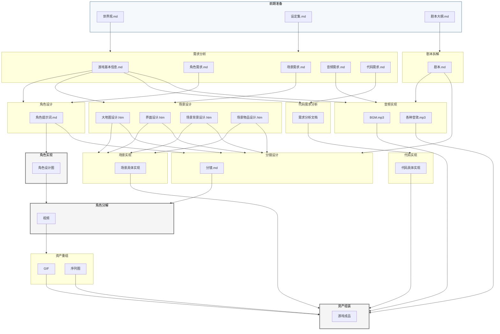

# 万物为铜 - 游戏开发流程图

---

## 图例说明

| 样式 | 含义 |
|------|------|
| 灰色 | 人工处理 |
| 浅蓝色 | 前期准备（输入资料） |

---

## Skill 与流程对应表

| 流程 | Skill | 类型 |
|------|-------|------|
| 需求分析 | `需求分析` | 自动 |
| 剧本拆解 | `剧本拆解` | 自动 |
| 角色设计 | `角色设计` | 自动 |
| 场景设计 | `场景设计` | 自动 |
| 代码需求分析 | `代码需求分析` | 自动 |
| 角色实现 | - | 人工 |
| 场景实现 | `场景实现` | 自动 |
| 音频实现 | `音频实现` | 自动 |
| 代码实现 | `代码实现` | 自动 |
| 分镜设计 | `分镜生成` | 自动 |
| 角色分解 | - | 人工 |
| 资产重组 | `资产重组` | 自动 |
| 资产组装 | - | 人工 |
