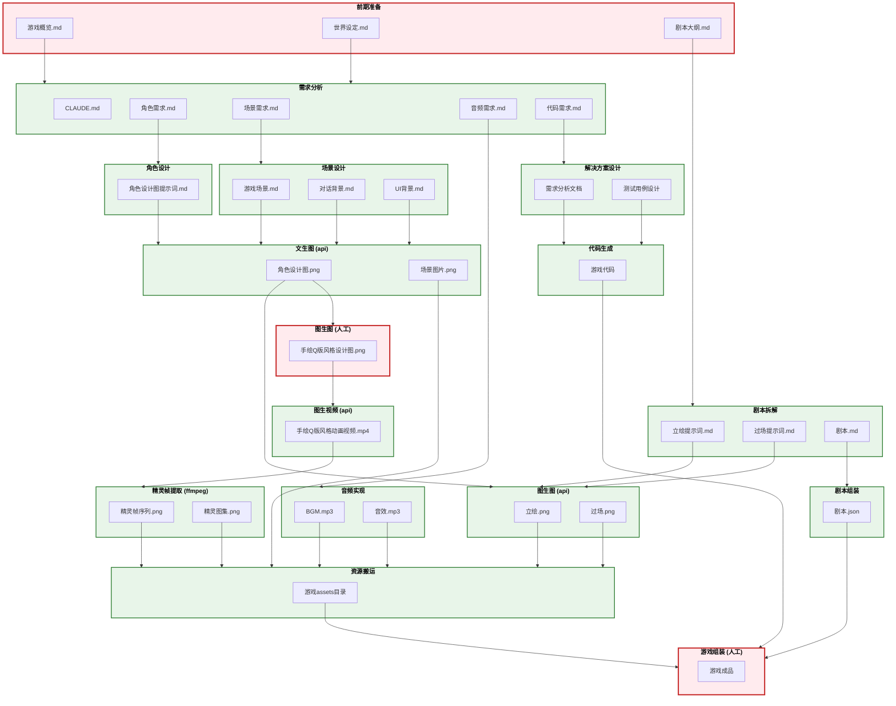

# 万物为铜 - 游戏开发流程图



---

## 图例说明

| 样式 | 含义 |
|------|------|
| 红色边框 | 人工完成 |
| 绿色边框 | Skill 自动完成 |

---

## Skill 说明

| Skill | 说明 |
|-------|------|
| **需求分析** | 将世界观和设定集转化为结构化的开发需求文档（角色需求、场景需求、音频需求、代码需求），并更新 CLAUDE.md |
| **剧本拆解** | 将剧本大纲转化为详细的分场剧本，包含对话、动作、场景描述，并生成立绘表情提示词和过场提示词 |
| **角色设计** | 根据角色需求，生成用于 AI 绘图的角色设计图提示词（手绘动漫风格，三视图，纯白背景） |
| **场景设计** | 根据场景需求，生成游戏场景、对话背景、UI 背景三类场景的 AI 绘图提示词（油画风格） |
| **解决方案设计** | 基于代码需求进行技术方案分析，输出需求分析文档和测试用例设计，为代码生成提供输入 |
| **文生图 (api)** | 调用 seedream API，根据文本提示词生成角色设计图和场景图片 |
| **图生图 (api)** | 调用 seedream API，基于设计图 + 提示词生成角色立绘和过场图片 |
| **图生视频 (api)** | 调用 seedance API，基于 Q 版设计图生成角色动画视频 |
| **精灵帧提取** | 使用 ffmpeg 从动画视频中提取精灵帧序列，并拼接为精灵图集 |
| **音频实现** | 根据音频需求生成 BGM 和音效 |
| **代码生成** | 根据需求分析文档和测试用例，生成游戏源代码 |
| **资源搬运** | 将各设计总览中状态为"终稿"的成品资源同步到游戏项目目录，白色背景转透明，并生成搬运记录 |
| **剧本组装** | 将分场剧本组装为游戏引擎可用的 JSON 数据格式 |

---

## 目录结构

```
万物为铜/
├── 00_init/
│   ├── 游戏概览.md
│   ├── 世界设定.md
│   └── 剧本大纲.md
│
├── 01_需求文档/
│   ├── 角色需求.md
│   ├── 场景需求.md
│   ├── 音频需求.md
│   └── 代码需求.md
│
├── 02_角色设计/
│   ├── 角色设计总览.md
│   ├── 主角/
│   │   └── char_001/
│   │       ├── 设计图提示词.md
│   │       ├── 设计图.png
│   │       ├── 手绘Q版风格设计图.png
│   │       ├── 立绘/
│   │       │   ├── 提示词.md
│   │       │   └── *.png
│   │       ├── 动画/
│   │       │   ├── 提示词.md
│   │       │   └── *.png
│   ├── NPC/
│   └── 怪物/
│
├── 03_场景设计/
│   ├── 场景设计总览.md
│   ├── 游戏场景/
│   │   ├── 战斗场景/scene_xxx_场景名/提示词.md
│   │   └── 功能场景/scene_xxx_场景名/提示词.md
│   ├── 对话背景/dialog_xxx_场景名/提示词.md
│   └── UI背景/ui_xxx_界面名/提示词.md
│
├── 04_剧本/
│   ├── 剧本总览.md
│   ├── 章节/
│   │   ├── 第一章.md
│   │   └── ...
│   └── 分镜/
│
├── 05_音频/
│   ├── 音频需求.md
│   ├── BGM/
│   └── 音效/
│
├── 10_解决方案设计/
│   ├── 需求分析文档.md
│   └── 测试用例设计.md
│
├── 89_game/
│   └── AllCooper/
│       ├── project.godot
│       ├── scenes/
│       │   ├── levels/
│       │   ├── ui/
│       │   └── dialogs/
│       ├── scripts/
│       │   ├── core/
│       │   ├── player/
│       │   ├── combat/
│       │   ├── ai/
│       │   └── ui/
│       ├── assets/
│       │   ├── sprites/
│       │   │   ├── characters/
│       │   │   ├── enemies/
│       │   │   └── effects/
│       │   ├── backgrounds/
│       │   ├── ui/
│       │   └── audio/
│       │       ├── bgm/
│       │       └── sfx/
│       └── addons/
│
├── 99_流程管理/
│
└── .claude/skills/
```
