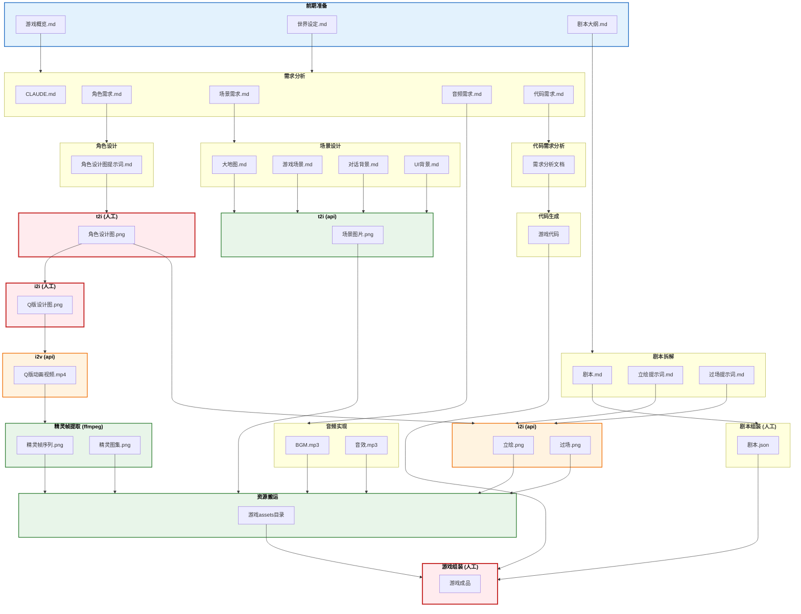

# 万物为铜 - 游戏开发流程图



---

## 图例说明

| 样式 | 含义 | 示例环节 |
|------|------|---------|
| 🔴 红色边框 | 纯人工处理 | t2i(人工)、i2i(人工)、游戏组装 |
| 🟠 橙色边框 | AI辅助（需人工参与） | i2i(图片)、i2v(api) |
| 🟢 绿色边框 | 自动化处理 | t2i(api)、精灵帧提取、资源搬运 |
| 🔵 蓝色边框 | 前期准备（输入资料） | 世界观、设定集、剧本大纲 |

## 名词解释

| 术语 | 全称 | 含义 |
|------|------|------|
| t2i | Text to Image | 文字生成图片 |
| i2i | Image to Image | 图片生成图片 |
| i2v | Image to Video | 图片生成视频 |

---

## 目录结构

```
万物为铜/
├── 00_init/
│   ├── 游戏概览.md
│   ├── 世界设定.md
│   └── 剧本大纲.md
│
├── 01_需求文档/
│   ├── 角色需求.md
│   ├── 场景需求.md
│   ├── 音频需求.md
│   └── 代码需求.md
│
├── 02_角色设计/
│   ├── 角色设计总览.md
│   ├── 主角/
│   │   └── char_001/
│   │       ├── 设计图提示词.md
│   │       ├── 设计图.png
│   │       ├── 立绘/
│   │       │   ├── 提示词.md
│   │       │   └── *.png
│   │       ├── 动画/
│   │       │   ├── 提示词.md
│   │       │   └── *.png
│   │       └── Q版/
│   │           ├── 设计图.png
│   │           ├── 动画.mp4
│   │           └── 精灵图集.png
│   ├── NPC/
│   └── 怪物/
│
├── 03_场景设计/
│   ├── 场景设计总览.md
│   ├── 大地图/
│   │   └── map_001/
│   │       ├── 提示词.md
│   │       └── 场景图.png
│   ├── 游戏场景/
│   ├── 对话背景/
│   └── UI背景/
│
├── 04_剧本/
│   ├── 剧本总览.md
│   ├── 章节/
│   │   ├── 第一章.md
│   │   └── ...
│   └── 分镜/
│
├── 05_音频/
│   ├── 音频需求.md
│   ├── BGM/
│   └── 音效/
│
├── 89_game/
│   └── AllCooper/
│       ├── project.godot
│       ├── scenes/
│       │   ├── levels/
│       │   ├── ui/
│       │   └── dialogs/
│       ├── scripts/
│       │   ├── core/
│       │   ├── player/
│       │   ├── combat/
│       │   ├── ai/
│       │   └── ui/
│       ├── assets/
│       │   ├── sprites/
│       │   │   ├── characters/
│       │   │   ├── enemies/
│       │   │   └── effects/
│       │   ├── backgrounds/
│       │   ├── ui/
│       │   └── audio/
│       │       ├── bgm/
│       │       └── sfx/
│       └── addons/
│
├── 99_变更管理/
│
└── .claude/skills/
```